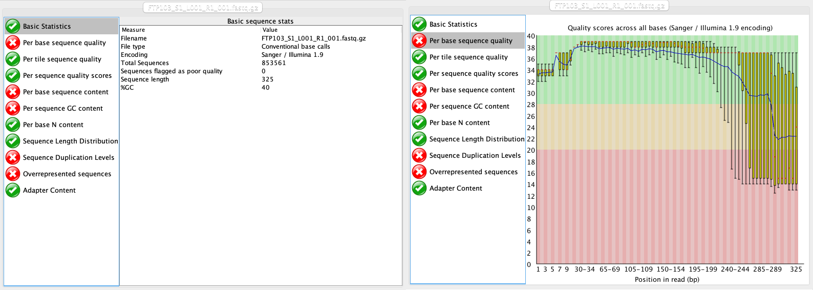

# Sequence data preparation

## 1. Introduction

To start, let's navigate to the raw sequencing file in the `raw` folder within the `~/obss_2024/edna/` directory and list the files in the subdirectory. To navigate between directories, we can use the `cd` command, which stands for **change directory**. It is always a good idea to check if the code executed as expected. In this case, we can verify the current working directory, i.e., the directory we navigated to with the `cd` command, by using the `pwd`  command, which stands for **print working directory**.

```bash
$ cd ~/obss_2024/edna/raw/
$ pwd
```

```
/home/<username>/obss_2024/edna/extra/raw
```
{: .output}

To list all the documents and subdirectories in our working directory, we can use the `ls` command. Additionally, we will specify the `-ltr` parameters to the `ls` command. The `l` parameter provides the list in long format that includes the permissions, which will come in handy when we are creating our scripts (but more on that later). The `t` parameter sorts the output by time and date, while the `r` parameter is printing the list in reverse order, i.e., the newest files will be printed at the bottom of the list. The reverse order using `r` is particularly handy when you are working with hundreds of files, as you don't have to scroll up to find the files that were created using the latest executed command.

```bash
$ ls -ltr
```

```
-rw-r-----+ 1 jeuge18p nesi02659 124306274 Nov 20 08:46 FTP103_S1_L001_R1_001.fastq.gz
```
{: .output}

From the output, we can see that the sequencing file is currently zipped, i.e., file extension **.gz**. This is done to reduce file sizes and facilitate file transfer between the sequencing service and the customer. Most software will be able to read and use zipped files, so there is no need to unzip the file now. However, always check if software programs are capable of handling zipped files.

If we look at the left-hand side of the output, we can see the permissions of the files and directories in the list that was printed using the `ls -ltr` command. For our raw sequencing file, we have the `r`, `w`, and `x` permissions. Besides these 3 permissions, two additional ones also exist, namely `d` and `@`. Below is a list of what these permissions indicate.

* `d`: directory - indicates that this is a folder or directory, rather than a file.
* `r`: read - specifies that we have access to read the file.
* `w`: write - specifies that we can write to the file.
* `x`: execute - specifies that we have permission to execute the file.
* `@`: extended - a novel symbol for MacOS indicating that the file has extended attributes (MacOS specific).

Finally, we can see that we have a single fastq file, the **R1_001.fastq.gz** file, indicating that the library was sequenced single-end. When you conduct paired-end sequencing, there will be a second file with an identical name, except for **R2** rather than **R1**. Because of our single-end sequencing strategy, we do not need to merge or assemble paired reads (see Introduction for more information). Although we do not need to merge our reads, I have provided an example code below on how you might be able to merge paired-end sequencing data using **VSEARCH**. (DO NOT RUN THE CODE BELOW, AS IT WILL FAIL!)

```bash
vsearch --fastq_mergepairs FTP103_S1_L001_R1_001.fastq.gz --reverse FTP103_S1_L001_R2_001.fastq.gz --fastqout FTP103_merged.fastq --fastq_allowmergestagger
```

## 2. Quality control

The first thing we will do with our sequencing file is to look at the quality and make sure everything is according to the sequencing parameters that were chosen. The program we will be using for this is <a href="https://www.bioinformatics.babraham.ac.uk/projects/fastqc/" target="_blank" rel="noopener noreferrer"><b>FastQC</b></a>. However, since you've already encountered this software program in a previous day, we'll just focus on the output for now.

<center></center>

At this stage, we will be looking at the tabs *Basic Statistics* and *Per base sequence quality*. From this report, we can see that:

1. We have a total of 853,561 sequences.
2. The sequence length is 325 bp, identical to the cycle number of the specified sequencing kit.
3. Sequence quality is dropping significantly at the end, which is typical for Illumina sequencing data.

## 3. Demultiplexing

### 3.1 Introduction to demultiplexing

Given that we only have a single sequence file containing all reads for multiple samples, the first step in our pipeline will be to assign each sequence to a sample, a process referred to as demultiplexing. To understand this step in the pipeline, we will need to provide some background on library preparation methods.

As of the time of writing this workshop, PCR amplification is the main method to generate eDNA metabarcoding libraries. To achieve species detection from environmental or bulk specimen samples, PCR amplification is carried out with primers designed to target a taxonomically informative marker within a taxonomic group. Furthermore, next generation sequencing data generates millions of sequences in a single sequencing run. Therefore, multiple samples can be combined. To achieve this, a unique sequence combination is added to the amplicons of each sample. This unique sequence combination is usually between 6 and 8 base pairs long and is referred to as ‘tag’, ‘index’, or ‘barcode’. Besides amplifying the DNA and adding the unique barcodes, sequencing primers and adapters need to be incorporated into the library to allow the DNA to be sequenced by the sequencing machine. How *barcodes*, *sequencing primers*, and *adapters* are added, and in which order they are added to your sequences will influence the data files you will receive from the sequencing service.

For example, traditionally prepared Illumina libraries (ligation and two-step PCR) are constructed in the following manner (the colours mentioned refer to the figure below):

1. Forward Illumina adapter (red)
2. Forward barcode sequence (darkgreen)
3. Forward Illumina sequencing primer (orange)
4. Amplicon (including primers)
5. Reverse Illumina sequencing primer (lightblue)
6. Reverse barcode sequence (lightgreen)
7. Reverse Illumina adapter (darkblue)

This construction allows the Illumina software to identify the barcode sequences, which will result in the generation of a separate sequence file (or two for paired-end sequencing data) for each sample. This process is referred to as demultiplexing and is performed by the Illumina software.

<center></center>

When libraries are prepared using the single-step PCR method, the libraries are constructed slightly different (the colours mentioned refer to the setup described in the two-step approach):

1. Forward Illumina adapter (red)
2. Forward Illumina sequencing primer (orange)
3. Forward barcode sequence (darkgreen)
4. Amplicon (including primers)
5. Reverse barcode sequence (lightgreen)
6. Reverse Illumina sequencing primer (lightblue)
7. Reverse Illumina adapter (darkblue)

In this construction, the barcode sequences are not located in between the Illumina adapter and Illumina sequencing primer, but are said to be ‘inline’. These inline barcode sequences cannot be identified by the Illumina software, since it does not know when the barcode ends and the primer sequence of the amplicon starts. Therefore, this will result in a single sequence file (or two for paired-end sequencing data) containing the data for all samples together. The demultiplexing step, assigning sequences to a sample, will have to be incorporated into the bioinformatic pipeline, something we will cover now in the workshop.

For more information on Illumina sequencing, you can watch the following 5-minute <a href="https://www.youtube.com/watch?v=fCd6B5HRaZ8" target="_blank" rel="noopener noreferrer"><b>youtube video (EMP)</b></a>. Notice that the ‘Sample Prep’ method described in the video follows the two-step PCR approach.

### 3.2 Assigning sequences to corresponding samples

During library preparation for our sample data, each sample was assigned a specific barcode combination, with at least 3 basepair differences between each barcode used in the library. By searching for these specific sequences, which are situated at the very beginning and very end of each sequence, we can assign each sequence to the corresponding sample. We will be using **cutadapt** for demultiplexing our dataset today, as it is the fastest option. Cutadapt requires an additional metadata text file in fasta format. This text file contains information about the sample name and the associated barcode and primer sequences.

Let's have a look at the metadata file, which can be found in the `meta` subfolder.

```bash
$ cd ../meta/
$ ls -ltr
```

```
-rw-r-----+ 1 jeuge18p nesi02659 1139 Nov 20 08:46 sample_metadata.fasta
```
{: .output}

To investigate the first couple of lines of a text file (unzipped), we can use the `head` command. The number of the `-n` parameter specifies the number of lines that will be printed.

```bash
$ head -n 10 sample_metadata.fasta
```

```
>AM1
GAAGAGGACCCTATGGAGCTTTAGAC;min_overlap=26...AGTTACYHTAGGGATAACAGCGCGACGCTA;min_overlap=30
>AM2
GAAGAGGACCCTATGGAGCTTTAGAC;min_overlap=26...AGTTACYHTAGGGATAACAGCGCGAGTAGA;min_overlap=30
>AM3
GAAGAGGACCCTATGGAGCTTTAGAC;min_overlap=26...AGTTACYHTAGGGATAACAGCGCGAGTCAT;min_overlap=30
>AM4
GAAGAGGACCCTATGGAGCTTTAGAC;min_overlap=26...AGTTACYHTAGGGATAACAGCGCGATAGAT;min_overlap=30
>AM5
GAAGAGGACCCTATGGAGCTTTAGAC;min_overlap=26...AGTTACYHTAGGGATAACAGCGCGATCTGT;min_overlap=30
```
{: .output}

From the output, we can see that this is a simple two-line fasta format, with the header line containing the sample name info indicated by **">"** and the barcode/primer info on the following line. We can also see that the forward and reverse barcode/primer sequences are split by **"..."** and that we specify a minimum overlap between the sequence found in the data file and the metadata file to be the full length of the barcode/primer information.

Note that by specifying the barcode + primer region, cutadapt will automatically identify which sequence belongs to which sample (barcode) and remove all artificial parts of our sequence (barcode + primer) to only retain our amplicon sequence. If you receive already-demultiplexed data from the sequencing service, be aware that you most likely need to remove the primer regions yourself. This can be done using the cutadapt code below as well.

> ## Count the number of samples in the metadata file
> before we get started with our first script, let's first determine how many samples are included in our experiment.
>
> Hint 1: think about the file structure of the metadata file.
> 
> Hint 2: a similar line of code can be written to count the number of sequences in a fasta file (which you might have come across before during OBSS2024)
> 
>> ## Solution
>> ~~~
>> grep -c "^>" sample_metadata.fasta
>> ~~~
>>
>> `grep` is a command that searches for strings that match a pattern
>> `-c` is the parameter indicating to count the number of times we find the pattern
>> `"^>"` is the string we need to match, in this case `>`. The `^` indicates that the string needs to occur at the beginning of the line.
> {: .solution}
{: .challenge}

Let's now write our first script to demultiplex our sequence data. First, we'll navigate to the `scripts` folder. When listing the files in this folder, we see that a script has already been created, so let's see what it contains.

```bash
$ cd ../scripts/
$ ls -ltr
```

```
-rwxr-x---+ 1 jeuge18p nesi02659 189 Nov 20 08:46 moduleload
```
{: .output}

To read a text file in its entirity, we can use the `nano` command, which will open a new window.

```bash
$ nano moduleload
```

```
#!/bin/bash

module load CRABS/1.0.6
module load FastQC/0.12.1
module load cutadapt/4.4-gimkl-2022a-Python-3.11.3
module load VSEARCH/2.21.1-GCC-11.3.0
module load BLAST/2.13.0-GCC-11.3.0
```

When opening this file, we can see that the script starts with what is called a **shebang** `#!`. This sign lets the computer know how to interpret the script. The following lines are specific to NeSI, where we will load the necessary software programs to run our scripts. We will, therefore, add this script to all subsequent scripts to make sure the correct software is available on NeSI.

To exit the script, we can press `ctr + X`, which will bring us back to the terminal window.

### 3.3 Our first script

To create a new script to demultiplex our data, we can type the following:

```bash
$ nano demux
```

This command will open the file `demux` in the nano text editor in the terminal. In here, we can type the following commands:

```bash
$ #!/bin/bash
$
$ source moduleload
$
$ cd ../raw/
$
$ cutadapt FTP103_S1_L001_R1_001.fastq.gz -g file:../meta/sample_metadata.fasta -o ../input/{name}.fastq --discard-untrimmed --no-indels -e 0 --cores=0
```

We can exit out of the text editor by pressing `ctr+X`, then type `y` to save the file, and press `enter` to save the file as `demux`. When we list the files in the `scripts` folder, we can see that this file is now created, but that it is not yet executable (no `x` in file description).

```bash
$ ls -ltr
```

```
-rwxr-x---+ 1 jeuge18p nesi02659 189 Nov 20 08:46 moduleload
-rw-rw----+ 1 jeuge18p nesi02659 194 Nov 20 09:09 demux
```
{: .output}

To make the script executable, we can use the following code:

```bash
$ chmod +x demux
```

When we now list the files in our `scripts` folder again, we see that the parameters have changed:

```bash
$ ls -ltr
```

```
-rwxr-x---+ 1 jeuge18p nesi02659 189 Nov 20 08:46 moduleload
-rwxrwx--x+ 1 jeuge18p nesi02659 194 Nov 20 09:09 demux
```
{: .output}

To run the script, we can type:

```bash
$ ./demux
```

Once this script has been executed, it will generate quite a bit of output in the terminal. The most important information, however, can be found at the top, indicating how many sequences could be assigned. The remainder of the output is detailed information for each sample.

```
This is cutadapt 4.4 with Python 3.11.3
Command line parameters: FTP103_S1_L001_R1_001.fastq.gz -g file:../meta/sample_metadata.fasta -o ../input/{name}.fastq --discard-untrimmed --no-indels -e 0 --cores=0
Processing single-end reads on 70 cores ...
Done           00:00:08       853,561 reads @   9.5 µs/read;   6.33 M reads/minute
Finished in 8.136 s (9.532 µs/read; 6.29 M reads/minute).

=== Summary ===

Total reads processed:                 853,561
Reads with adapters:                   128,874 (15.1%)

== Read fate breakdown ==
Reads discarded as untrimmed:          724,687 (84.9%)
Reads written (passing filters):       128,874 (15.1%)

Total basepairs processed:   277,407,325 bp
Total written (filtered):     26,075,782 bp (9.4%)
```
{: .output}

If successfully completed, the script should've generated a single fastq file for each sample in the metadata file and placed these files in the `input` directory. Let's see if the files have been created using the `ls` command.

```bash
$ ls -ltr ../input/
```

```
-rw-rw----+ 1 jeuge18p nesi02659 5404945 Nov 20 09:10 AM1.fastq
-rw-rw----+ 1 jeuge18p nesi02659 4906020 Nov 20 09:10 AM2.fastq
-rw-rw----+ 1 jeuge18p nesi02659 3944614 Nov 20 09:10 AM3.fastq
-rw-rw----+ 1 jeuge18p nesi02659 5916544 Nov 20 09:10 AM4.fastq
-rw-rw----+ 1 jeuge18p nesi02659 5214931 Nov 20 09:10 AM5.fastq
-rw-rw----+ 1 jeuge18p nesi02659 4067965 Nov 20 09:10 AM6.fastq
-rw-rw----+ 1 jeuge18p nesi02659 4841565 Nov 20 09:10 AS2.fastq
-rw-rw----+ 1 jeuge18p nesi02659 9788430 Nov 20 09:10 AS3.fastq
-rw-rw----+ 1 jeuge18p nesi02659 5290868 Nov 20 09:10 AS4.fastq
-rw-rw----+ 1 jeuge18p nesi02659 5660255 Nov 20 09:10 AS5.fastq
-rw-rw----+ 1 jeuge18p nesi02659 4524100 Nov 20 09:10 AS6.fastq
-rw-rw----+ 1 jeuge18p nesi02659     461 Nov 20 09:10 ASN.fastq
```
{: .output}

> ## Count the number of demultiplexed files
> We know from the metadata file that we will be analysing 12 files. While with this low number we can quickly count the number of items in the list, counting files in this manner becomes more difficult for larger projects. How would you calculate the number of files that were created by cutadapt?
>
> Hint 1: we know the directory the files were created in and how to create the list of files.
>
> Hint 2: make use of piping and counting functions in bash
> 
>> ## Solution
>> ~~~
>> ls -1 ../input/ | wc -l
>> ~~~
>>
>> `|` is a pipe that parses the output from one command into the input of the next
>> `wc` is a function to count items (*word count*)
>> `-l` is a parameter that specifies that what should be counted are lines, not words.
> {: .solution}
{: .challenge}

> ## Count the number of demultiplexed sequences
> cutadapt reported that 128,874 sequences were demultiplexed. How would you count the total number of sequences across the 12 demultiplexed files?
>
> Hint 1: think about the file structure of fastq files
>
> Hint 2: make use of piping and counting functions in bash
> 
>> ## Solution
>> ~~~
>> cat ../input/*.fastq | wc -l | awk '{print $1 / 4}'
>> ~~~
>>
>> `cat` is a function to combine all 12 fastq files in the `input` directory
>> `|` is a pipe that parses the output from one command into the input of the next
>> `wc` is a function to count items (*word count*)
>> `-l` is a parameter that specifies that what should be counted are lines, not words
>> `awk` is a very powerful computer language to parse text
>> `{print $1 / 4}` is the parameter passed to `awk` to print the number of lines found by `wc` and divides this number by 4, due to the file structure of a fastq file.
> {: .solution}
{: .challenge}

## 4 Renaming sequence headers to incorporate sample names

Before continuing, let's have a look at the file structure of the demultiplexed fastq files using the `head` command.

```bash
$ head -n 12 ../input/AM1.fastq
```

```
@M02181:93:000000000-D20P3:1:1101:15402:1843 1:N:0:1
GACAGGTAGACCCAACTACAAAGGTCCCCCAATAAGAGGACAAACCAGAGGGACTACTACCCCCATGTCTTTGGTTGGGGCGACCGCGGGGGAAGAAGTAACCCCCACGTGGAACGGGAGCACAACTCCTTGAACTCAGGGCCACAGCTCTAAGAAACAAAATTTTTGACCTTAAGATCCGGCAATGCCGATCAACGGACCG
+
2222E2GFFCFFCEAEF3FFBD32FFEFEEE1FFD55BA1AAEEFFE11AA??FEBGHEGFFGE/F3GFGHH43FHDGCGEC?B@CCCC?C??DDFBF:CFGHGFGFD?E?E?FFDBD.-A.A.BAFFFFFFBBBFFBB/.AADEF?EFFFF///9BBFE..BFFFF;.;FFFB///BBFA-@=AFFFF;-BADBB?-ABD;
@M02181:93:000000000-D20P3:1:1101:16533:1866 1:N:0:1
TTTAGAACAGACCATGTCAGCTACCCCCTTAAACAAGTAGTAATTATTGAACCCCTGTTCCCCTGTCTTTGGTTGGGGCGACCACGGGGAAGAAAAAAACCCCCACGTGGACTGGGAGCACCTTACTCCTACAACTACGAGCCACAGCTCTAATGCGCAGAATTTCTGACCATAAGATCCGGCAAAGCCGATCAACGGACCG
+
GGHCFFBFBB3BA2F5FA55BF5GGEGEEHF55B5ABFB5F55FFBGGB55GEEEFEGFFEFGC1FEFFGBBGH?/??EC/>E/FE???//DFFFFF?CDDFFFCFCF...>DAA...<.<CGHFFGGGH0CB0CFFF?..9@FB.9AFFGFBB09AAB?-/;BFFGB/9F/BFBB/BFFF;BCAF/BAA-@B?/B.-.@DA
@M02181:93:000000000-D20P3:1:1101:18101:1874 1:N:0:1
ACTAGACAACCCACGTCAAACACCCTTACTCTGCTAGGAGAGAACATTGTGGCCCTTGTCTCACCTGTCTTCGGTTGGGGCGACCGCGGAGGACAAAAAGCCTCCATGTGGACTGAAGTAACTATCCTTCACAGCTCAGAGCCGCGGCTCTACGCGACAGAAATTCTGACCAAAAATGATCCGGCACATGCCGATTAACGGAACA
+
BFGBA4F52AEA2A2B2225B2AEEGHFFHHF5BD551331113B3FGDGB??FEGG2FEEGBFFGFGCGHE11FE??//>//<</<///<</CFFB0..<F1FE0G0D000<<AC0<000<DDBC:GGG0C00::C0/00:;-@--9@AFBB.---9--///;F9F//;B/....;//9BBA-9-;.BBBB>-;9A/BAA.999
```
{: .output}

We can see that the sequences within each file do not contain any information to which sample they belong to. Currently, the sequences still have the initial Illumina sequence headers. To make things a bit easier for us, it would be best if the sequences themselves would contain the sample info, rather than having a file per sample. This would enable us to merge all files and run the bioinformatic code on a single file, rather than having to write loops to execute the code on each file separately, which can be a bit more daunting and complex. Luckily, we can rename the sequence headers using **VSEARCH**, after which we can combine all files using the `cat` command.

Let's write our second script!

```bash
$ nano rename
```

```bash
$ #!/bin/bash
$
$ source moduleload
$ 
$ cd ../input/
$
$ for fq in *.fastq; do vsearch --fastq_filter $fq --relabel $fq. --fastqout rl_$fq; done
$
$ cat rl* > ../output/relabel.fastq
```

```bash
$ chmod +x rename
```

```bash
$ ./rename
```

Once executed, the script will first rename the sequence headers of each file and store them in a new file per sample. Lastly, we combine all relabeled files using the `cat` command. This combined file can be found in the `output` folder. Let's see if it is there and how the sequence headers have been altered:

```bash
$ ls -ltr ../output/
```

```
-rw-rw----+ 1 jeuge18p nesi02659 54738505 Nov 20 09:19 relabel.fastq
```
{: .output}

```bash
head -n 12 ../output/relabel.fastq
```

```
@AM1.1
GACAGGTAGACCCAACTACAAAGGTCCCCCAATAAGAGGACAAACCAGAGGGACTACTACCCCCATGTCTTTGGTTGGGGCGACCGCGGGGGAAGAAGTAACCCCCACGTGGAACGGGAGCACAACTCCTTGAACTCAGGGCCACAGCTCTAAGAAACAAAATTTTTGACCTTAAGATCCGGCAATGCCGATCAACGGACCG
+
2222E2GFFCFFCEAEF3FFBD32FFEFEEE1FFD55BA1AAEEFFE11AA??FEBGHEGFFGE/F3GFGHH43FHDGCGEC?B@CCCC?C??DDFBF:CFGHGFGFD?E?E?FFDBD.-A.A.BAFFFFFFBBBFFBB/.AADEF?EFFFF///9BBFE..BFFFF;.;FFFB///BBFA-@=AFFFF;-BADBB?-ABD;
@AM1.2
TTTAGAACAGACCATGTCAGCTACCCCCTTAAACAAGTAGTAATTATTGAACCCCTGTTCCCCTGTCTTTGGTTGGGGCGACCACGGGGAAGAAAAAAACCCCCACGTGGACTGGGAGCACCTTACTCCTACAACTACGAGCCACAGCTCTAATGCGCAGAATTTCTGACCATAAGATCCGGCAAAGCCGATCAACGGACCG
+
GGHCFFBFBB3BA2F5FA55BF5GGEGEEHF55B5ABFB5F55FFBGGB55GEEEFEGFFEFGC1FEFFGBBGH?/??EC/>E/FE???//DFFFFF?CDDFFFCFCF...>DAA...<.<CGHFFGGGH0CB0CFFF?..9@FB.9AFFGFBB09AAB?-/;BFFGB/9F/BFBB/BFFF;BCAF/BAA-@B?/B.-.@DA
@AM1.3
ACTAGACAACCCACGTCAAACACCCTTACTCTGCTAGGAGAGAACATTGTGGCCCTTGTCTCACCTGTCTTCGGTTGGGGCGACCGCGGAGGACAAAAAGCCTCCATGTGGACTGAAGTAACTATCCTTCACAGCTCAGAGCCGCGGCTCTACGCGACAGAAATTCTGACCAAAAATGATCCGGCACATGCCGATTAACGGAACA
+
BFGBA4F52AEA2A2B2225B2AEEGHFFHHF5BD551331113B3FGDGB??FEGG2FEEGBFFGFGCGHE11FE??//>//<</<///<</CFFB0..<F1FE0G0D000<<AC0<000<DDBC:GGG0C00::C0/00:;-@--9@AFBB.---9--///;F9F//;B/....;//9BBA-9-;.BBBB>-;9A/BAA.999
```
{: .output}

Finally, to check if no sequences were lost during renaming, we can use the `wc` command.

```bash
wc -l ../output/relabel.fastq | awk '{print $1 / 4}'
```

```
128874
```
{: .output}


