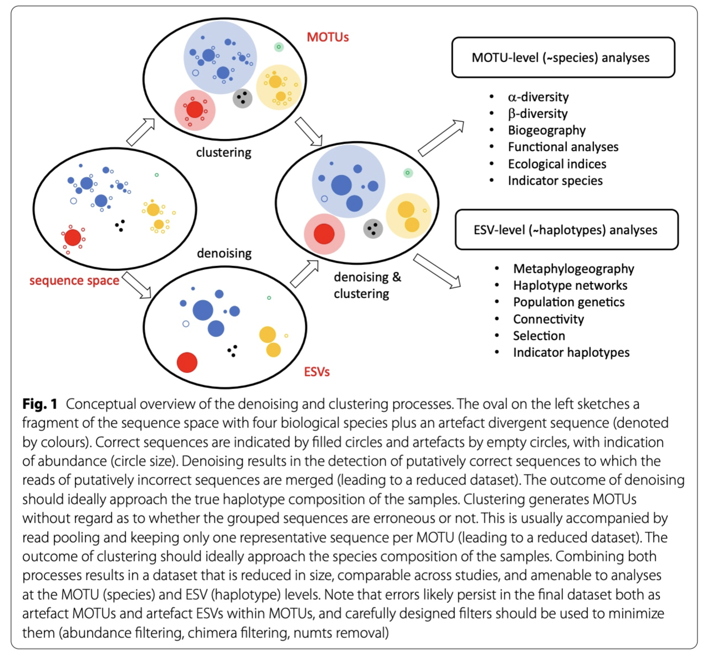

# Bioinformatic analysis

## 1. Quality filtering

### 1.1 Introduction

During the bioinformatic pipeline, it is critical to only retain high-quality reads to reduce the abundance and impact of spurious sequences. There is an intrinsic error rate to all polymerases used during PCR amplification, as well as sequencing technologies. For example, the most frequently used polymerase during PCR is *Taq*, though lacks 3’ to 5’ exonuclease proofreading activity, resulting in relatively low replication fidelity. These errors will generate some portion of sequences that vary from their biological origin sequence. Such reads can substantially inflate metrics such as alpha diversity, especially in a denoising approach (more on this later). While it is near-impossible to remove all of these sequences bioinformatically, especially PCR errors, we will attempt to remove erroneous reads by filtering on base calling quality scores (the fourth line of a sequence record in a .fastq file).

For quality filtering, we will discard all sequences that do not adhere to a specific set of rules. We will be using the program <a href="https://www.bioinformatics.babraham.ac.uk/projects/fastqc/" target="_blank" rel="noopener noreferrer"><b>VSEARCH (EMP)</b></a> for this step. Quality filtering parameters are not standardized, but rather specific for each library. For our tutorial data, we will filter out all sequences that do not adhere to a minimum and maximum length, have unassigned base calls (‘N’), and have a higher expected error than 1. Once we have filtered our data, we can check the quality with FastQC and compare it to the raw sequencing file. As this is the last step in our bioinformatic pipeline where quality scores are essential, we will export our output files both in .fastq and .fasta format.

### 1.2 Filtering sequence data

```bash
$ nano qual
```

```bash
$ #!/bin/bash
$
$ source moduleload
$
$ cd ../output/
$
$ vsearch --fastq_filter relabel.fastq --fastq_maxee 1.0 --fastq_maxlen 230 --fastq_minlen 150 --fastq_maxns 0 --fastaout filtered.fasta --fastqout filtered.fastq
```

```bash
$ chmod +x qual
```

```bash
$ ./qual
```

```
vsearch v2.21.1_linux_x86_64, 503.8GB RAM, 72 cores
https://github.com/torognes/vsearch

Reading input file 100%  
123537 sequences kept (of which 0 truncated), 5337 sequences discarded.
```
{: .output}

After quality filtering, we have 123,537 sequences left over in the fastq and fasta files. Before we continue with the pipeline, let's check if the quality filtering was successful using **FastQC**.

```bash
nano qualcheck
```

```bash
#!/bin/bash

source moduleload

cd ../output/

fastqc filtered.fastq -o ../meta/
```

```bash
$ chmod +x qualcheck
```

```bash
$ ./qualcheck
```

<center></center>

When we now look at the *Basic Statistics* and *Per base sequence quality* tabs, we can see that:

1. Our total number of sequences has been reduced to 123,537, similar to the number specified by our `qual` script.
2. The sequence length ranges from 176-214, according to amplicon length and within the range of the parameters chosen in the `qual` script.
3. The sequence quality is high throughout the amplicon length (within the green zone).

We can, therefore, conclude that quality filtering was successful and we can now move to the clustering step of the pipeline.

> ## Count the number of quality filtered sequences for each sample
> Since we are working with a single file, VSEARCH reports the total number of sequences that were retained and discarded. How would we calculate the number of sequences that were retained for each sample?
>
> Hint 1: think about the sequence header structure
>
> Hint 2: use the solution in the previous exercise where we calculated the number of sequences across multiple files.
> 
>> ## Solution
>> ~~~
>> grep "^>" ../output/filtered.fasta | cut -d '.' -f 1 | sort | uniq -c
>> ~~~
> {: .solution}
{: .challenge}

## 2. Dereplication

Once we have verified that the reads passing quality filtering are of high quality and of a length similar to the expected amplicon size, we need to dereplicate the data into unique sequences. Since metabarcoding is based on a PCR amplification method, the same DNA molecule will have been copied thousands or millions of times and, therefore, sequenced multiple times. In order to reduce the file size and computational cost, it is convenient to work with unique sequences and keep track of how many times each unique sequence was found in our data set. This dereplication step is also the reason why we combined all samples into a single file, as the same amplicon (or species if you will) can be found across different samples.

```bash
nano derep
```

```bash
#!/bin/bash

source moduleload

cd ../output/

vsearch --derep_fulllength filtered.fasta --relabel uniq. --sizeout --output uniques.fasta
```

```bash
chmod +x derep
./derep
```

```
vsearch v2.21.1_linux_x86_64, 503.8GB RAM, 72 cores
https://github.com/torognes/vsearch

Dereplicating file filtered.fasta 100%  
25083932 nt in 123537 seqs, min 176, max 214, avg 203
Sorting 100%
6645 unique sequences, avg cluster 18.6, median 1, max 19554
Writing FASTA output file 100% 
```
{: .output}

To determine if everything executed properly, we can check the `uniques.fasta` file using the `head` command.

```bash
$ head -n 12 ../output/uniques.fasta
```

```
>uniq.1;size=19554
TTTAGAACAGACCATGTCAGCTACCCCCTTAAACAAGTAGTAATTATTGAACCCCTGTTCCCCTGTCTTTGGTTGGGGCG
ACCACGGGGAAGAAAAAAACCCCCACGTGGACTGGGAGCACCTTACTCCTACAACTACGAGCCACAGCTCTAATGCGCAG
AATTTCTGACCATAAGATCCGGCAAAGCCGATCAACGGACCG
>uniq.2;size=14321
ACTAAGGCATATTGTGTCAAATAACCCTAAAACAAAGGACTGAACTGAACAAACCATGCCCCTCTGTCTTAGGTTGGGGC
GACCCCGAGGAAACAAAAAACCCACGAGTGGAATGGGAGCACTGACCTCCTACAACCAAGAGCTGCAGCTCTAACTAATA
GAATTTCTAACCAATAATGATCCGGCAAAGCCGATTAACGAACCA
>uniq.3;size=8743
ACCAAAACAGCTCCCGTTAAAAAGGCCTAGATAAAGACCTATAACTTTCAATTCCCCTGTTTCAATGTCTTTGGTTGGGG
CGACCGCGGAGTACTACCAAACCTCCATGTGGACCGAAAGAACATCTTTTATAGCTCCGAGTGACAACTCTAAGTAACAG
AACATCTGACCAGTATGATCCGGCATAGCCGATCAACGAACCG
```
{: .output}

> ## Study Question 1
> What do you think the following parameters are doing?
>
> - `--sizeout`
> - `--relabel uniq.`
>
>> ## Solution
>> `--sizeout`: this will print the number of times a sequence has occurred in the header information. You can use the `head` command on the sorted file to check how many times the most abundant sequence was encountered in our sequencing data.
>>
>> `--relabel uniq.`: this parameter will relabel the header information to `uniq.` followed by an ascending number, depending on how many different sequences have been encountered.
>>
> {: .solution}
{: .challenge}

> ## Count the number of singleton sequences
> VSEARCH has reported the total number of unique sequences. How would you calculate the number of singleton sequences in our file?
>
> Hint 1: think about the sequence header structure
>
> Hint 2: make sure to not count sequences where the number starts with 1, e.g., 10.
> 
>> ## Solution
>> ~~~
>> grep -c "size=1\b" ../output/uniques.fasta
>> ~~~
> {: .solution}
{: .challenge}

> ## Print the most and least abundant sequences
> How would you determine the number of times the 10 most and 10 least abundant unique sequences were observed?
>
> Hint 1: keep in mind the order of the sequences in the file.
> 
>> ## Solution
>> ~~~
>> awk '/^>uniq/ {a[i++]=$0} END {for (j=i-10; j<i; j++) print a[j]; for (k=0; k<10; k++) print a[k]}' ../output/uniques.fasta
>> ~~~
> {: .solution}
{: .challenge}

## 3. Denoising

### 3.1 Introduction

Now that our data set is filtered and unique sequences have been retrieved, we are ready for the next step in the bioinformatic pipeline, i.e., looking for **biologically meaningful** or **biologically correct** sequences. Two approaches to achieve this goal exist, including `denoising` and `clustering`. There is still an ongoing debate on what the best approach is to obtain these **biologically meaningful** sequences. For more information, these are two good papers to start with: <a href="https://onlinelibrary.wiley.com/doi/full/10.1111/1755-0998.13398" target="_blank" rel="noopener noreferrer"><b>Brandt et al., 2021</b></a>; <a href="https://bmcbioinformatics.biomedcentral.com/articles/10.1186/s12859-021-04115-6" target="_blank" rel="noopener noreferrer"><b>Antich et al., 2021</b></a>. For this workshop, we won’t be discussing this topic in much detail, but this is the basic idea…

When **clustering** the dataset, OTUs (Opterational Taxonomic Units) will be generated by combining sequences that are similar to a set percentage level (traditionally 97%), with the most abundant sequence identified as the true sequence. When clustering at 97%, this means that if a sequence is more than 3% different than the generated OTU, a second OTU will be generated. The concept of OTU clustering was introduced in the 1960s and has been debated since. Clustering the dataset is usually used for identifying species in metabarcoding data.

**Denoising**, on the other hand, attempts to identify all correct biological sequences through an algorithm, which is visualised in the figure below. In short, denoising will cluster the data with a 100% threshold and tries to identify errors based on abundance differences. The retained sequences are called ZOTU (Zero-radius Operation Taxonomic Unit) or ASVs (Amplicon Sequence Variants). Denoising the dataset is usually used for identifying intraspecific variation in metabarcoding data. A schematic of both approaches can be found below.



This difference in approach may seem small but has a very big impact on your final dataset!  
  
When you denoise the dataset, it is expected that one species may have more than one ZOTU. This means that diversity estimates will be highly inflated. Luckily, we have recently developed an algorithm to counteract this issue (but more on this later). When clustering the dataset, on the other hand, it is expected that an OTU may have more than one species assigned to it, meaning that you may lose some correct biological sequences that are present in your data by merging species with barcodes more similar than 97%. In other words, you will miss out on differentiating closely related species and intraspecific variation.
  
For this workshop, we will follow the `denoising` approach, as it is favoured in recent years. Plus with novel data curation methods, e.g., *tombRaider* (introduced later in this workshop), the issue of diversity inflation has been largely resolved. However, clustering is still a valid option. So, feel free to explore this approach for your own data set if you prefer.


### 3.2 Denoising the data

For denoising, we will use the *unoise3 algorithm* as implemented in **VSEARCH**. Since denoising is based on read abundance of the unique sequences, we can specify the `--sizein` parameter. The minimum abundance threshold for a true denoised read is defaulted to 8 reads, as specified by the unoise3 algorithm developer. However, more recent research by <a href="https://www.nature.com/articles/nmeth.2276" target="_blank" rel="noopener noreferrer"><b>Bokulich et al., 2013</b></a>, identified a minimum abundance threshold to be more appropriate. Hence, we will set the `--minsize` parameter to 0.0001%, which in our case is ~12 reads.

```bash
nano denoise
```

```bash
#!/bin/bash

source moduleload

cd ../output/

vsearch --cluster_unoise uniques.fasta --sizein --minsize 12 --sizeout --relabel denoised. --centroids denoised.fasta
```

```bash
chmod +x denoise
./denoise
```

```
vsearch v2.21.1_linux_x86_64, 503.8GB RAM, 72 cores
https://github.com/torognes/vsearch

Reading file uniques.fasta 100%  
46023 nt in 227 seqs, min 189, max 213, avg 203
minsize 12: 6418 sequences discarded.
Masking 100% 
Sorting by abundance 100%
Counting k-mers 100% 
Clustering 100%  
Sorting clusters 100%
Writing clusters 100% 
Clusters: 49 Size min 12, max 24181, avg 4.6
Singletons: 0, 0.0% of seqs, 0.0% of clusters
```
{: .output}

From the output, we can see that we have generated a list of 49 ZOTUs. Additionally, we can see that 6,418 out of 6,645 unique sequences were discarded, as they didn't reach the minimum abundance threshold of 12 sequences.

## 4. Chimera removal

The second to last step in our bioinformatic pipeline is to remove chimeric sequences. Amplicon sequencing has the potential to generate chimeric reads, which can cause spurious inference of biological variation. Chimeric amplicons form when an incomplete DNA strand anneals to a different template and primes synthesis of a new template derived from two different biological sequences, or in other words chimeras are artefact sequences formed by two or more biological sequences incorrectly joined together. More information can be found within this <a href="https://www.biorxiv.org/content/biorxiv/early/2016/09/09/074252.full.pdf" target="_blank" rel="noopener noreferrer"><b>paper</b></a> and a simple illustration can be found below.


We will use the `--uchime3_denovo` algorithm as implemented in VSEARCH for removing chimeric sequences from our denoised reads.

```bash
nano chimera
```

```bash
#!/bin/bash

source moduleload

cd ../output/

vsearch --uchime3_denovo denoised.fasta --sizein --relabel zotu. --nonchimeras ../final/zotus.fasta
```

```bash
chmod +x chimera
./chimera
```

```
vsearch v2.21.1_linux_x86_64, 503.8GB RAM, 72 cores
https://github.com/torognes/vsearch

Reading file denoised.fasta 100%  
9907 nt in 49 seqs, min 189, max 213, avg 202
Masking 100% 
Sorting by abundance 100%
Counting k-mers 100% 
Detecting chimeras 100%  
Found 17 (34.7%) chimeras, 32 (65.3%) non-chimeras,
and 0 (0.0%) borderline sequences in 49 unique sequences.
Taking abundance information into account, this corresponds to
448 (0.4%) chimeras, 110965 (99.6%) non-chimeras,
and 0 (0.0%) borderline sequences in 111413 total sequences.
```
{: .output}

The output shows that 99.6% of our denoised reads were kept and 32 sequences were incorporated into our final ZOTU list.

**The zotus.fasta file is the first output file we have created that we need for our statistical analysis!**

## 5. Count table

Now that we have created our list of **biologically relevant sequences** or **ZOTUs** or **“species”**, we are ready to generate a count table, also known as a frequency table. This will be the last step in our bioinformatic analysis pipeline. A count table is something you might have encountered before during some traditional ecological surveys you have conducted, whereby a table was created with site names as column headers, a species list as rows, and the number in each cell representing the number of individuals observed for a specific species at a specific site.

In metabarcoding studies, a count table is analogous, where it tells us how many times each sequence has appeared in each sample. It is the end-product of all the bioinformatic processing steps we have conducted today. Now that we have identified what we believe to be true biological sequences, we are going to generate our count table by matching the merged sequences to our ZOTU sequence list. Remember that the sequences within the `filtered.fasta` file have the information of the sample they belong to present in the sequence header, which is how the `--usearch_global` command in **VSEARCH** can generate the count table. The `--db` parameter allows us to set the ZOTU sequence list (zotus.fasta) as the database to search against, while we can specify the `--strand` parameter as plus, since all sequences are in the same direction after primer trimming. Finally, we need to incorporate a 97% identity threshold for this function through the `--id` parameter. This might seem counter-intuitive, since we employed a denoising approach. However, providing some leniency on which sequences can map to our ZOTU will allow us to incorporate a larger percentage of the data set. As some ZOTUs might be more similar to each other than 97%, the algorithm will sort out the best match and add the sequence to the correct ZOTU sequence. If you’d like to be more conservative, you can set this threshold to 99%, though this is not recommended by the authors.

```bash
nano table
```

```bash
#!/bin/bash

source moduleload

cd ../output/

vsearch --usearch_global filtered.fasta --db ../final/zotus.fasta --strand plus --id 0.97 --otutabout ../final/zotutable.txt
```

```bash
chmod +x table
./table
```

```
vsearch v2.21.1_linux_x86_64, 503.8GB RAM, 72 cores
https://github.com/torognes/vsearch

Reading file ../final/zotus.fasta 100%  
6476 nt in 32 seqs, min 189, max 213, avg 202
Masking 100% 
Counting k-mers 100% 
Creating k-mer index 100% 
Searching 100%  
Matching unique query sequences: 122120 of 123537 (98.85%)
Writing OTU table (classic) 100%
```
{: .output}

The output printed to the Terminal window shows that we managed to map 122,120 sequences to the ZOTU list, which were incorporated into our count table.

**That's it for the bioinformatic processing of our sequencing data, we can now move on to assigning a taxonomic ID to our ZOTUs!**


