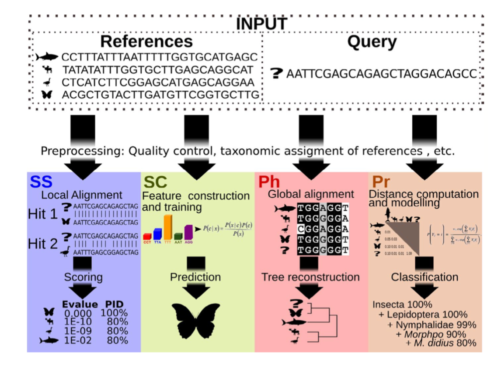
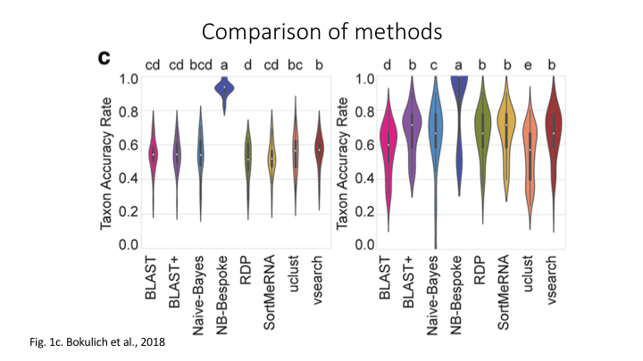

# Taxonomy assignment

## 1. Introduction

As we have previously discussed, eDNA metabarcoding is the process whereby we amplify a specific gene region of the taxonomic group of interest from a DNA extract obtained from an environmental sample. Once the DNA is amplified, a library is prepared for sequencing. Up to this point, we have prepared the data for the bioinformatic process and executed a bioinformatic pipeline, which ended with a count table (**zotutable.txt**) and a ZOTU list (**zotus.fasta**) containing all the biologically relevant sequences. The next step in the bioinformatic process will be to assign a taxonomic ID to each sequence to determine what species were detected through our eDNA metabarcoding analysis.

There are four basic strategies to taxonomy classification based on (<a href="https://onlinelibrary.wiley.com/doi/epdf/10.1111/1755-0998.13407" target="_blank" rel="noopener noreferrer"><b>Hleap et al. (2021)</b></a>) (and endless variations of each of these):

- **Sequence Similarity** (SS)
- **Sequence Composition** (SC)
- **Phylogenetic** (Ph)
- **Probabilistic** (Pr)



Of the four abovementioned strategies to taxonomy classification, the **Sequence Similarity** and **Sequence Composition** methods are currently the most frequently used for taxonomy assignment in the metabarcoding research community. Multiple comparative experiments have been conducted to determine the most optimal approach to assign a taxonomic ID to metabarcoding data, though it seems to be that the main conclusion of those papers is that their own method is best. One example of a comparative study is the one from <a href="https://microbiomejournal.biomedcentral.com/articles/10.1186/s40168-018-0470-z" target="_blank" rel="noopener noreferrer"><b>Bokulich et al., 2018</b></a>.



While there are multiple ways to assign a taxonomic ID to a sequence, all methods require a reference database to match your ZOTUs to a set of sequences with known taxonomic IDs. So, before we start with taxonomy assignment, let's create our own local curated reference database using (<a href="https://github.com/gjeunen/reference_database_creator" target="_blank" rel="noopener noreferrer"><b>CRABS</b></a>), which stands for **C**reating **R**eference databases for **A**mplicon-**B**ased **S**equencing.

## 2. Reference databases

Several reference databases are available online. The most notable ones being NCBI, EMBL, BOLD, SILVA, and RDP. However, recent research has indicated a need to use custom curated reference databases to increase the accuracy of taxonomy assignment. While certain gene-specific or primer-specific reference databases are available (RDP: 16S microbial; MIDORI: COI eukaryotes; etc.), this essential data source is missing in most instances. We will, therefore, show you how to build your own custom curated reference database using CRABS.

For time-saving purposes, we will only build a small reference database that includes sharks (Chondrichthyes) for the primer set used during this experiment, rather than the reference database we will be using for taxonomy assignment later on that includes bony fish and sharks. However, the code provided here can be changed to build a reference database for any primer set or taxonomic group by changing some of the parameters. The final reference database that we will be using later on for taxonomy assignment is already placed in the `refdb` folder on NeSI.

### 2.1 CRABS workflow

The CRABS workflow consists of seven parts, including:

- (1) download data from online repositories;
- (2) import downloaded data into CRABS format;
- (3) extract amplicons through *in silico* PCR analysis;
- (4) retrieving amplicons without primer-binding regions through pairwise global alignments;
- (5) curate and subset the local database;
- (6) export the local database in various taxonomic classifier formats; and
- (7) basic visualizations to explore the local reference database.


### 2.2 Help documentation

To bring up the help documentation for CRABS, we will first have to source the `moduleload` script to load the program.

```bash
source moduleload
crabs -h
```


### 2.3 Step 1: download data from online repositories

As a first step, we will download the 16S shark sequences from the NCBI online repository. While there are multiple repositories supported by CRABS, we'll only focus on this one today, as NCBI is the most-widely used online repository in metabarcoding research. To download data from the NCBI servers, we need to provide a few parameters to CRABS. Maybe one of the trickiest to understand is the `--query` parameter. However, we can get the input string for this parameter from the NCBI website, as shown on the screenshot below.


```bash
cd ../refdb/
crabs --download-ncbi --query '(16S[All Fields] AND ("Chondrichthyes"[Organism] OR Chondrichthyes[All Fields])) AND mitochondrion[filter]' --database nucleotide --email gjeunen@gmail.com --output ncbi_16S_chondrichthyes.fasta
```

```
/// CRABS | v1.0.6

|            Function | Download NCBI database
|Retrieving NCBI info | ━━━━━━━━━━━━━━━━━━━━━━━━━━━━━━━━━━━━━━━━ 100% 0:00:00 0:00:01
|         Downloading | ━━━━━━━━━━━━━━━━━━━━━━━━━━━━━━━━━━━━━━━━ 100% 0:00:00 0:00:23
|             Results | Number of sequences downloaded: 3764/3764 (100.0%)
```
{: .output}

Let's look at the top 10 lines of the downloaded fasta file to see what CRABS created:

```bash
head -n 10 ncbi_16S_chondrichthyes.fasta
```

```
>PP329120.1 Mobula hypostoma isolate MHBRsp_Gua mitochondrion, complete genome
GCTAGTGTAGCTTAATTTAAAGCATGGCACTGAAGATGCTAAGATAAAAATTAACCTTTTTCACAAGCAT
GAAGGTTTGGTCCCAGCCTCAATATTAGTTTTAACTTGACTTACACATGCAAGTCTCAGCATTCCGGTGA
GAACGCCCTAATCACCCCTAAAATTTGATTAGGAGCTGGTATCAGGCACATTCCAAGAACAGCCCATGAC
ACCTCGCTCAGCCACACCCACAAGGGAACTCAGCAGTGATAGATATTGTTCTATAAGCGCAAGCTTGAGA
CAATCAAAGTTATAAAGAGTTGGTTAATCTCGTGCCAGCCACCGCGGTTATACGAGTGACACAAATTAAT
ATTTCACGGCGTTAAGGGTGATTAGAAATAATCTCATCAGTATAAAGTTAAGACCTCATTAAGCTGTCAT
ACGCACTTATGATCGAAAACATCATTCACGAAAGTAACTTTACACAAACAGAATTTTTGACCTCACGACA
GTTAAGGCCCAAACTAGGATTAGATACCCTACTATGCTTAACCGCAAACATTGTTATTAATTAATACTAC
CTTAATACCCGCCTGAGTACTACAAGCGCTAGCTTAAAACCCAAAGGACTTGGCGGTGCTCCAAACCCAC
```
{: .output}

Here, we can see that the CRABS has downloaded the original format from the NCBI servers, which is a multi-line fasta document.

### 2.4 Step 2: import downloaded data into CRABS format

Since CRABS can download data from multiple online repositories, each with their own format, we need to first reformat the data to CRABS format before we can continue building our reference database. This reformatting can be done using the `--import` function, which will create a single line text document for each sequence, that contains a unique ID, the taxonomic lineage for that sequence, plus the sequence itself. The CRABS taxonomic lineage is based on the NCBI taxonomy database and requires 3 files to be downloaded using the `--download-taxonomy` function. However, to speed things up, these 3 files have already been provided to you.

```bash
crabs --import --import-format ncbi --names names.dmp --nodes nodes.dmp --acc2tax nucl_gb.accession2taxid --input ncbi_16S_chondrichthyes.fasta --output ncbi_16S_chondrichthyes.txt --ranks 'superkingdom;phylum;class;order;family;genus;species'
```

```
/// CRABS | v1.0.6

|            Function | Import sequence data into CRABS format
| Read data to memory | ━━━━━━━━━━━━━━━━━━━━━━━━━━━━━━━━━━━━━━━━ 100% 0:00:00 0:05:29
|Phylogenetic lineage | ━━━━━━━━━━━━━━━━━━━━━━━━━━━━━━━━━━━━━━━━ 100% 0:00:00 0:00:00
|Fill missing lineage | ━━━━━━━━━━━━━━━━━━━━━━━━━━━━━━━━━━━━━━━━ 100% 0:00:00 0:00:00
|             Results | Imported 3764 out of 3764 sequences into CRABS format (100.0%)
```
{: .output}

When we now look at the first line of the imported document, we can see how the structure has changed:

```bash
head -n 1 ncbi_16S_chondrichthyes.txt
```

```
PP329120	Mobula hypostoma	723540	Eukaryota	Chordata	Chondrichthyes	Myliobatiformes	Myliobatidae	Mobula	Mobula hypostoma	GCTAGTGTAGCTTAATTTAAAGCATGGCACTGAAGATGCTAAGATAAAAATTAACCTTTTTCACAAGCATGAAGGTTT...
```
{: .output}

### 2.5 Step 3: extract amplicons through *in silico* PCR

Once we have formatted the data, we can start with a first curation step of the reference database, i.e., extracting the amplicon sequences. We will be extracting the amplicon region from each sequence through an *in silico* PCR analysis. With this analysis, we will locate the forward and reverse primer binding regions and extract the sequence in between. This will significantly reduce file sizes when larger data sets are downloaded, while also ensuring that only the necessary information is kept.

```bash
crabs --in-silico-pcr --input ncbi_16S_chondrichthyes.txt --output ncbi_16S_chondrichthyes_amplicon.txt --forward GACCCTATGGAGCTTTAGAC --reverse CGCTGTTATCCCTADRGTAACT
```

```
/// CRABS | v1.0.6

|            Function | Extract amplicons through in silico PCR
|         Import data | ━━━━━━━━━━━━━━━━━━━━━━━━━━━━━━━━━━━━━━━━ 100% 0:00:00 0:00:00
|  Transform to fasta | ━━━━━━━━━━━━━━━━━━━━━━━━━━━━━━━━━━━━━━━━ 100% 0:00:00 0:00:00
|       In silico PCR | ━━━━━━━━━━━━━━━━━━━━━━━━━━━━━━━━━━━━━━━━ 100% 0:00:00 0:00:00
|      Exporting data | ━━━━━━━━━━━━━━━━━━━━━━━━━━━━━━━━━━━━━━━━ 100% 0:00:00 0:00:00
|             Results | Extracted 3427 amplicons from 3764 sequences (91.05%)
```
{:output}

### 2.6 Step 4: extract amplicons through pairwise global alignments

Amplicons in the originally downloaded sequences might be missed during the in silico PCR analysis when one or both primer-binding regions are not incorporated in the online deposited sequence. This can happen when the reference barcode is generated with the same primer set or if the deposited sequence is incomplete in the primer-binding regions (denoted as “N” in the sequence). To retrieve those missed amplicons, we can use the already-retrieved amplicons as seed sequences in a Pairwise Global Alignment (PGA) analysis.

```bash
crabs --pairwise-global-alignment --input ncbi_16S_chondrichthyes.txt --amplicons ncbi_16S_chondrichthyes_amplicon.txt --output ncbi_16S_chondrichthyes_pga.txt --forward GACCCTATGGAGCTTTAGAC --reverse CGCTGTTATCCCTADRGTAACT --percent-identity 0.9 --coverage 90
```

```
/// CRABS | v1.0.6

|            Function | Retrieve amplicons without primer-binding regions
|         Import data | ━━━━━━━━━━━━━━━━━━━━━━━━━━━━━━━━━━━━━━━━ 100% 0:00:00 0:00:00
|  Transform to fasta | ━━━━━━━━━━━━━━━━━━━━━━━━━━━━━━━━━━━━━━━━ 100% 0:00:00 0:00:00
|  Pairwise alignment | ━━━━━━━━━━━━━━━━━━━━━━━━━━━━━━━━━━━━━━━━   0% -:--:-- 0:00:01
|Parse alignment data | ━━━━━━━━━━━━━━━━━━━━━━━━━━━━━━━━━━━━━━━━ 100% 0:00:00 0:00:00
|      Exporting data | ━━━━━━━━━━━━━━━━━━━━━━━━━━━━━━━━━━━━━━━━ 100% 0:00:00 0:00:00
|             Results | Retrieved 42 amplicons without primer-binding regions from 337 sequences
```
{:output}

### 2.7 Step 5: dereplicating the database

Now that we have retrieved all amplicons from the downloaded sequences, we can remove duplicate sequences for each species, i.e., dereplicating the reference database. This step helps reduce the file size even more, plus is essential for most taxonomic classifiers that restrict the output to N number of best hits.

```bash
crabs --dereplicate --input ncbi_16S_chondrichthyes_pga.txt --output ncbi_16S_chondrichthyes_derep.txt --dereplication-method unique_species
```

```
/// CRABS | v1.0.6

|            Function | Dereplicate CRABS database
|         Import data | ━━━━━━━━━━━━━━━━━━━━━━━━━━━━━━━━━━━━━━━━ 100% 0:00:00 0:00:00
|      Exporting data | ━━━━━━━━━━━━━━━━━━━━━━━━━━━━━━━━━━━━━━━━ 100% 0:00:00 0:00:00
|             Results | Written 723 unique sequences to ncbi_16S_chondrichthyes_derep.txt out of 3469 initial sequences (20.84%)
```
{:output}

### 2.8 Step 6: filter the reference database

The final curation step for our custom reference database is to clean up the database using a variety of parameters, including minimum length, maximum length, maximum number of ambiguous base calls, environmental sequences, sequences for which the species name is not provided, and sequences with unspecified taxonomic levels.

```bash
crabs --filter --input ncbi_16S_chondrichthyes_derep.txt --output ncbi_16S_chondrichthyes_clean.txt --minimum-length 150 --maximum-length 250 --environmental --no-species-id --maximum-n 1 --rank-na 2
```

```
/// CRABS | v1.0.6

|            Function | Filter CRABS database
| Included parameters | "--minimum-length", "--maximum-length", "--maximum-n", "--environmental", "--no-species-id", "--rank-na"
|         Import data | ━━━━━━━━━━━━━━━━━━━━━━━━━━━━━━━━━━━━━━━━ 100% 0:00:00 0:00:00
|      Exporting data | ━━━━━━━━━━━━━━━━━━━━━━━━━━━━━━━━━━━━━━━━ 100% 0:00:00 0:00:00
|             Results | Written 706 filtered sequences to ncbi_16S_chondrichthyes_clean.txt out of 723 initial sequences (97.65%)
|                     | Maximum ambiguous bases filter: 17 sequences not passing filter (2.35%)
```
{:output}

### 2.9 Step 7: export the reference database to a format supported by the taxonomic classifier software

Now that we have created a custom curated reference database containing 706 shark sequences for the 16S rRNA gene, we can export the reference database to be used by different taxonomic classifiers. Multiple formats are implemented in CRABS, but today we will be exporting the reference database to SINTAX format, which is a kmer based classifier implemented in USEARCH and VSEARCH.

```bash
crabs --export --input ncbi_16S_chondrichthyes_clean.txt --output ncbi_16S_chondrichthyes_sintax.fasta --export-format sintax
```

```
/// CRABS | v1.0.6

|            Function | Export CRABS database to SINTAX format
|         Import data | ━━━━━━━━━━━━━━━━━━━━━━━━━━━━━━━━━━━━━━━━ 100% 0:00:00 0:00:00
|      Exporting data | ━━━━━━━━━━━━━━━━━━━━━━━━━━━━━━━━━━━━━━━━ 100% 0:00:00 0:00:00
|             Results | Written 706 sequences to ncbi_16S_chondrichthyes_sintax.fasta out of 706 initial sequences (100.0%)
```
{:output}

Let's open the reference database to see what the final database looks like!

```bash
head -n 6 ncbi_16S_chondrichthyes_sintax.fasta
```

```
>PP329120;tax=d:Eukaryota,p:Chordata,c:Chondrichthyes,o:Myliobatiformes,f:Myliobatidae,g:Mobula,s:Mobula_hypostoma
ACTTAAGTCACTTTTAAGATATTAAATTTTTTCCTCAGGGTATAAAATAACAAACTAATTTTCTGACTTAACCTTGTTTTTGGTTGGGGCGACCGAGGGGTAAAACAAAACCCCCTTATCGAATGTGTGAAATATCACTTAAAAATTAGAGTTACATCTCTAGTTAATAGAAAATCTAACGAACAATGACCCAGGAAACTTATCCTGATCAATGAACCA
>PQ469261;tax=d:Eukaryota,p:Chordata,c:Chondrichthyes,o:Carcharhiniformes,f:Carcharhinidae,g:Prionace,s:Prionace_glauca
ACTTAAATTAATTATGTAACCATCCATTTCCCAGGAAATAAACAAAATATACAACACTTCTAATTTAACTGTTTTTGGTTGGGGTGACCAAGGGGAAAAACAAATCCCCCTCATCGATTGAGTACTAAGTACTTAAAAATTAGAATGACAATTCTAATTAATAAAACATTTACCGAAAAATGATCCAGGATTTCCTGATCAATGAACCA
>PQ182775;tax=d:Eukaryota,p:Chordata,c:Chondrichthyes,o:Carcharhiniformes,f:Triakidae,g:Mustelus,s:Mustelus_schmitti
ACTTAAGTTAATTATGTAACCATTTATTCCTTAGGGTATAAACAAAATATACAATACTTCTAACTTAACTGTTTTTGGTTGGGGTGACCGAGGGGGAAAACAAATCCCCCTCATCGATTGAGTACTCAGTACTTGAAAATCAGAATAACAATTCTGATTAATAAAATATTTAGCGAAAAATGACCCAGGATTTCCTGATCAATGAACCA
```
{: .output}

That's all it takes to generate your own reference database. We are now ready to assign a taxonomy to our OTUs that were generated in the previous section!

## 3. The 16S Vertebrate reference database

For our tutorial data set, we will be using the **sintax_vertebrata_16S.fasta** and **vertebrata_16S** databases, with the first one being in SINTAX format and the second one being in BLAST format. The reference databases were created using CRABS, as shown above, and contain data from the MitoFish online repository, NCBI online repository, and local New Zealand barcodes that we generated at the University of Otago. These reference databases hold 57,092 high quality, unique, 16S rRNA reference barcodes for vertebrate taxa.

## 4. Taxonomic classification

### 4.1 SINTAX

The first method we will explore is the SINTAX algorithm. The SINTAX algorithm predicts taxonomy by using k-mer similarity to identify the top hit in a reference database and provides bootstrap confidence for all ranks in the prediction. Unlike the RDP classifier, SINTAX does not rely on Bayesian posteriors. Hence, training the dat aset is not required and results can be obtained very quickly. SINTAX was developed for USEARCH and is also incorporated into VSEARCH through the `--sintax` command. More information about the SINTAX algorithm can be found on the <a href="https://www.drive5.com/usearch/manual/cmd_sintax.html" target="_blank" rel="noopener noreferrer"><b>USEARCH</b></a> website. When thinking about the four basic strategies for taxonomy assignment, SINTAX belongs to the Sequence Composition (SC) category.

```bash
cd ../scripts/
nano sintax
```

```bash
#!/bin/bash

source moduleload

cd ../final/

vsearch --sintax zotus.fasta --db ../refdb/sintax_vertebrata_16S.fasta --sintax_cutoff 0.8 --tabbedout sintax_taxonomy.txt
```

```bash
chmod +x sintax
./sintax
```

```
vsearch v2.21.1_linux_x86_64, 503.8GB RAM, 72 cores
https://github.com/torognes/vsearch

Reading file ../refdb/sintax_vertebrata_16S.fasta 100%  
WARNING: 1 invalid characters stripped from FASTA file: ?(1)
REMINDER: vsearch does not support amino acid sequences
10986499 nt in 57092 seqs, min 150, max 249, avg 192
Counting k-mers 100% 
Creating k-mer index 100% 
Classifying sequences 100%  
Classified 26 of 32 sequences (81.25%)
```
{: .output}

Taxonomy assignment through SINTAX was able to classify 27 out of 32 OTUs. Let's use the `head` command to inspect the output file.

```bash
head ../final/sintax_taxonomy.txt
```

```
zotu.3	d:Eukaryota(1.00),p:Chordata(1.00),c:Actinopteri(1.00),o:Perciformes(1.00),f:Bovichtidae(1.00),g:Bovichtus(1.00),s:Bovichtus_variegatus(1.00)	+	d:Eukaryota,p:Chordata,c:Actinopteri,o:Perciformes,f:Bovichtidae,g:Bovichtus,s:Bovichtus_variegatus
zotu.1	d:Eukaryota(1.00),p:Chordata(1.00),c:Actinopteri(1.00),o:Scombriformes(1.00),f:Gempylidae(1.00),g:Thyrsites(1.00),s:Thyrsites_atun(1.00)	+	d:Eukaryota,p:Chordata,c:Actinopteri,o:Scombriformes,f:Gempylidae,g:Thyrsites,s:Thyrsites_atun
zotu.5	d:Eukaryota(1.00),p:Chordata(1.00),c:Actinopteri(1.00),o:Labriformes(1.00),f:Labridae(1.00),g:Notolabrus(0.89),s:Notolabrus_fucicola(0.86)	+	d:Eukaryota,p:Chordata,c:Actinopteri,o:Labriformes,f:Labridae,g:Notolabrus,s:Notolabrus_fucicola
zotu.4	d:Eukaryota(1.00),p:Chordata(1.00),c:Actinopteri(1.00),o:Blenniiformes(1.00),f:Tripterygiidae(1.00),g:Forsterygion(1.00),s:Forsterygion_lapillum(0.99)	+	d:Eukaryota,p:Chordata,c:Actinopteri,o:Blenniiformes,f:Tripterygiidae,g:Forsterygion,s:Forsterygion_lapillum
zotu.6	d:Eukaryota(1.00),p:Chordata(1.00),c:Actinopteri(1.00),o:Blenniiformes(1.00),f:Tripterygiidae(1.00),g:Forsterygion(1.00),s:Forsterygion_lapillum(0.91)	+	d:Eukaryota,p:Chordata,c:Actinopteri,o:Blenniiformes,f:Tripterygiidae,g:Forsterygion,s:Forsterygion_lapillum
zotu.2	d:Eukaryota(1.00),p:Chordata(1.00),c:Actinopteri(1.00),o:Mugiliformes(1.00),f:Mugilidae(1.00),g:Aldrichetta(1.00),s:Aldrichetta_forsteri(1.00)	+	d:Eukaryota,p:Chordata,c:Actinopteri,o:Mugiliformes,f:Mugilidae,g:Aldrichetta,s:Aldrichetta_forsteri
zotu.12	d:Eukaryota(1.00),p:Chordata(1.00),c:Actinopteri(1.00),o:Myctophiformes(1.00),f:Myctophidae(1.00),g:Hygophum(1.00),s:Hygophum_hanseni(1.00)	+	d:Eukaryota,p:Chordata,c:Actinopteri,o:Myctophiformes,f:Myctophidae,g:Hygophum,s:Hygophum_hanseni
zotu.11	d:Eukaryota(1.00),p:Chordata(1.00),c:Actinopteri(1.00),o:Osmeriformes(1.00),f:Retropinnidae(1.00),g:Retropinna(1.00),s:Retropinna_retropinna(1.00)	+	d:Eukaryota,p:Chordata,c:Actinopteri,o:Osmeriformes,f:Retropinnidae,g:Retropinna,s:Retropinna_retropinna
zotu.9				
zotu.13	d:Eukaryota(1.00),p:Chordata(1.00),c:Actinopteri(1.00),o:Scombriformes(1.00),f:Centrolophidae(1.00),g:Seriolella(0.99),s:Seriolella_brama(0.99)	+	d:Eukaryota,p:Chordata,c:Actinopteri,o:Scombriformes,f:Centrolophidae,g:Seriolella,s:Seriolella_brama
```
{:output}

### 4.2 BLAST

The second and last method we will explore is BLAST (Basic Local Alignment Search Tool), probably the most well known and most widely used method to assign a taxonomic ID to sequences. As the name suggests, BLAST assigns a taxonomic ID to a sequence through best hits from local alignments against a reference database. Hence, when thinking about the four basic strategies for taxonomy assignment, BLAST belongs to the Sequence Similarity (SS) category. While BLAST can be run online and remotely against the full NCBI database, BLAST can also be run locally on a curated reference database. Since CRABS can download data from multiple online repositories, running BLAST locally will aid in increased taxonomic assignment accuracy by incorporating a larger number of barcodes.

```bash
nano blast
```

```bash
#!/bin/bash

source moduleload

cd ../refdb/

blastn -query ../final/zotus.fasta -db vertebrata_16S -max_target_seqs 1 -perc_identity 50 -qcov_hsp_perc 50 -outfmt "6 qaccver saccver staxid sscinames length pident mismatch qcovs evalue bitscore qstart qend sstart send gapopen" -out ../final/blast_taxonomy.txt
```

```bash
chmod +x blast
./blast
```

Running BLAST locally doesn't produce any text in the Terminal Window, but we can use the `head` command to inspect the output file.

```bash
head -n 32 ../final/blast_taxonomy.txt
```

```
zotu.1	OP168897	499858	Thyrsites atun	205	100.000	0	100	9.00e-106	379	1	205	1	205	0
zotu.2	JQ060654	443748	Aldrichetta forsteri	202	100.000	0	100	4.12e-104	374	1	202	1	202	0
zotu.3	MF991327	36205	Bovichtus variegatus	203	100.000	0	100	1.15e-104	375	1	203	1	203	0
zotu.4	AY141416	206115	Forsterygion lapillum	203	98.030	4	100	5.40e-98	353	1	203	1	203	0
zotu.5	EU848435	548164	Notolabrus fucicola	205	99.512	1	100	4.19e-104	374	1	205	1	205	0
zotu.6	AY141416	206115	Forsterygion lapillum	203	99.507	1	100	5.36e-103	370	1	203	1	203	0
zotu.7	AY520117	8210	Notothenia angustata	202	100.000	0	100	4.12e-104	374	1	202	1	202	0
zotu.8	NC_016669	691800	Sprattus muelleri	202	100.000	0	100	4.12e-104	374	1	202	1	202	0
zotu.9	MK335855	1311454	Istigobius ornatus	159	87.421	18	80	2.62e-46	182	40	197	39	196	2
zotu.10	GQ365289	159454	Hyporhamphus melanochir	203	100.000	0	100	1.15e-104	375	1	203	1	203	0
zotu.11	MZ301925	170203	Retropinna retropinna	205	100.000	0	100	9.00e-106	379	1	205	1	205	0
zotu.12	AB024914	89989	Hygophum hanseni	202	100.000	0	100	4.12e-104	374	1	202	1	202	0
zotu.13	AB205416	316134	Seriolella caerulea	205	100.000	0	100	9.00e-106	379	1	205	1	205	0
zotu.14	EU848442	443792	Lotella rhacina	200	96.500	7	100	2.49e-91	331	1	200	1	200	0
zotu.15	NC_080276	2972643	Salmo pallaryi	205	100.000	0	100	9.00e-106	379	1	205	1	205	0
zotu.16	KP411798	879484	Enneanectes reticulatus	149	85.906	20	73	4.57e-39	158	56	203	47	195	1
zotu.17	AY141416	206115	Forsterygion lapillum	205	85.854	27	100	7.47e-57	217	1	205	1	203	1
zotu.18	AY141416	206115	Forsterygion lapillum	203	97.537	5	100	2.51e-96	348	1	203	1	203	0
zotu.19	LC627613	107245	Lepidopus caudatus	204	100.000	0	99	3.24e-105	377	1	204	1	204	0
zotu.20	AY141416	206115	Forsterygion lapillum	205	86.341	26	100	1.61e-58	222	1	205	1	203	1
zotu.21	NC_016673	691801	Sprattus antipodum	202	99.505	1	100	1.92e-102	368	1	202	1	202	0
zotu.22	AY279764	241364	Odax pullus	201	100.000	0	100	1.47e-103	372	1	201	1	201	0
zotu.23	PP661061	2791166	Pseudophycis palmata	198	91.919	16	100	3.25e-75	278	1	198	1	198	0
zotu.24	AY141416	206115	Forsterygion lapillum	205	95.610	7	100	3.31e-90	327	1	205	1	203	1
zotu.25	NC_088030	1241940	Umbrina canosai	154	84.416	12	71	4.83e-34	141	62	213	59	202	6
zotu.26	KY020202	879906	Xiphasia setifer	132	78.030	26	68	9.44e-16	80.5	56	184	66	197	3
zotu.27	OM470922	2740763	Lepadogaster candolii	147	83.673	21	72	2.11e-32	135	56	200	54	199	3
zotu.28	PP661061	2791166	Pseudophycis palmata	198	91.414	17	100	1.51e-73	272	1	198	1	198	0
zotu.29	NC_016669	691800	Sprattus muelleri	202	98.515	3	100	4.15e-99	357	1	202	1	202	0
zotu.30	KY020202	879906	Xiphasia setifer	132	78.030	26	68	9.44e-16	80.5	56	184	66	197	3
zotu.31	NC_037961	2605477	Dipturus nasutus	210	100.000	0	100	1.54e-108	388	1	210	1	210	0
zotu.32	CRABS:Acanthoclinus_fuscus	2696578	Acanthoclinus fuscus	203	97.537	4	100	2.51e-96	348	1	203	1	202	1
```
{:output}

Using the `head` command shows us that BLAST managed to provide a taxonomic ID to all 32 ZOTU sequences in our data, unlike SINTAX, which managed to provide a taxonomic ID to only 27 ZOTUs. However, if we look at the output, the BLAST results are "low" in similarity and coverage for the ZOTUs for which SINTAX does not provide any taxonomic ID.

Please note that I do not recommend working on solely top BLAST hits, as we did in our example. This choice was done as a time-saving approach. I recommend setting the parameter `--max-target-seqs` to 50 or 100 and calculate the Most Recent Common Ancestor (MRCA) based on those BLAST results. While this is outside the scope of this workshop, there are some useful programs that are publicly available that can do this for you, e.g., <a href="https://github.com/gjeunen/ALEX" target="_blank" rel="noopener noreferrer"><b>ALEX</b></a> (Ancestor Link EXplorer).


