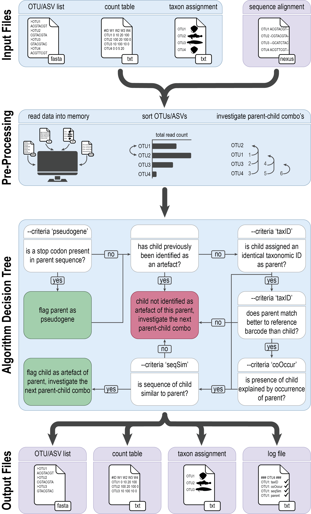
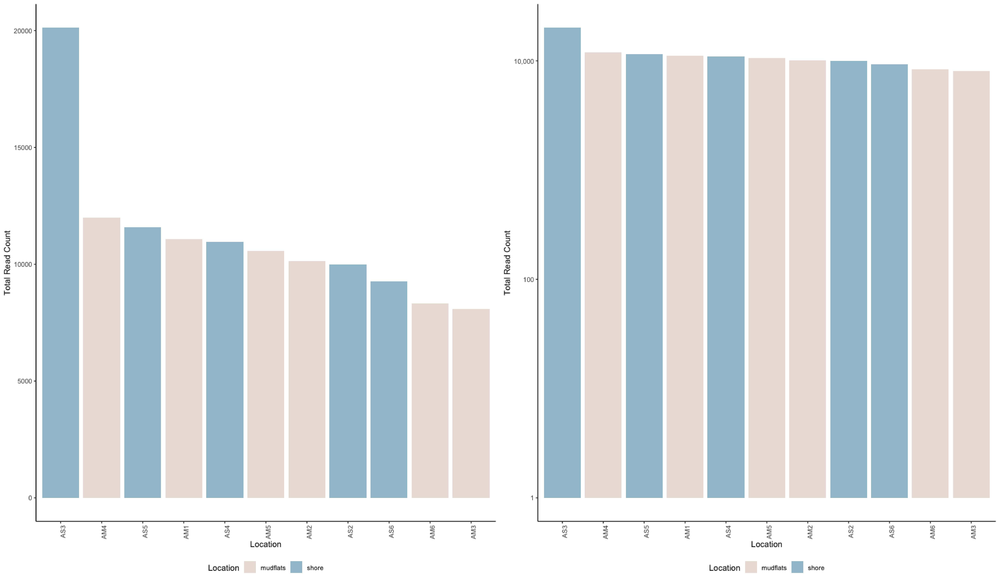
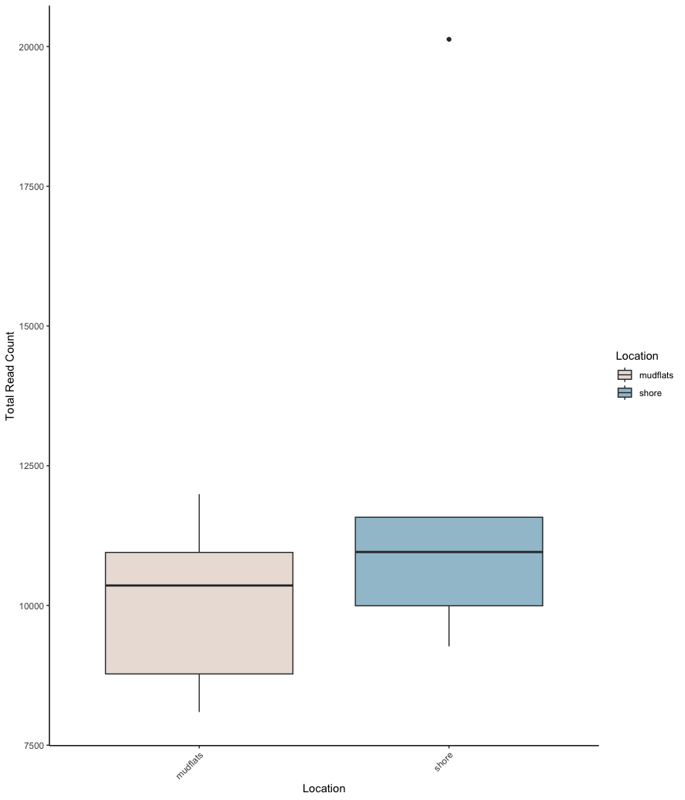
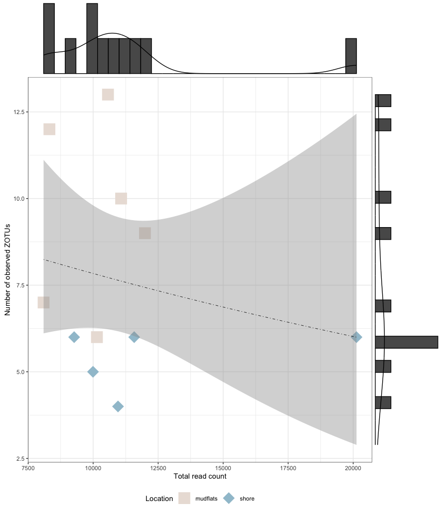
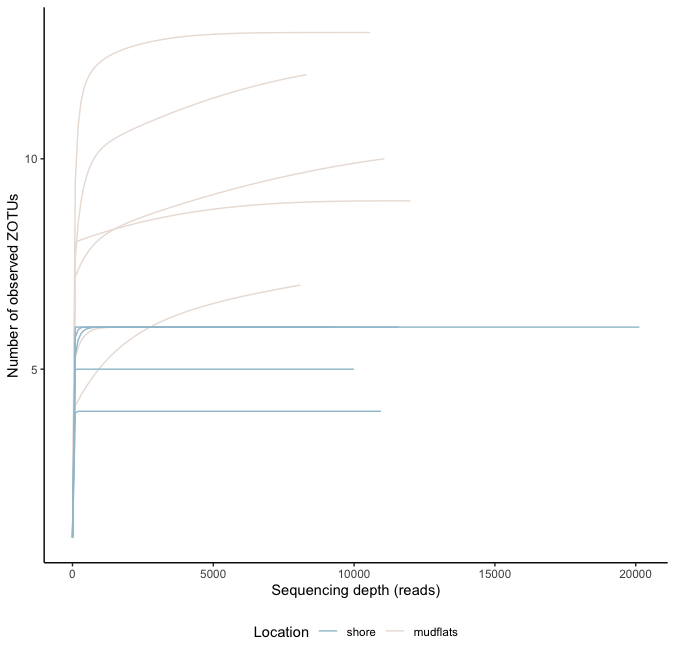
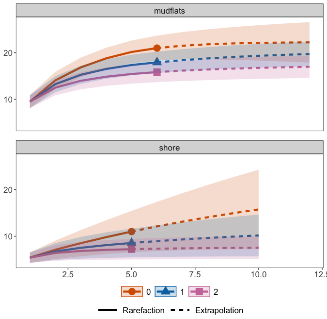

# Data curation

## 1. Introduction

At this point, we have created a file containing a list of ZOTUs (**zotus.fasta**), a count table (**zotutable.txt**), and a taxonomic ID for each ZOTU (**blast_taxonomy.txt**). Before exploring the data and conducting the statistical analysis, we need to perform some data curation steps to further clean the data. Within the eDNA metabarcoding research community, there is not yet a standardised manner of data curation. However, steps that are frequently included are (list is not in order of importance):

1. Abundance filtering of specific detections to eliminate the risk of barcode hopping signals interfering with the analysis.
   1. Either involves removing singleton detections or applying an abundance threshold.
2. Filtering of ZOTUs which have a positive detection in the negative control samples, either by:
   1. Complete removal of ZOTUs.
   2. Applying an abundance threshold obtained from the read count in the negative controls.
   3. A statistical test.
3. Removal of low-confidence taxonomy assignments (if analysis is taxonomy-dependent).
4. Discarding samples with low read count.
5. Removal of artefacts.
6. Transformation of raw read count to relative abundance, presence-absence, or other transformations.

## 2. Artefact removal through *tombRaider*

As a first data curation step, we will be removing spurious artefacts using a novel algorithm developed by our team, i.e., <a href="https://github.com/gjeunen/tombRaider" target="_blank" rel="noopener noreferrer"><b>*tombRaider*</b></a>. Although stringent quality filtering parameters have been employed during the bioinformatic processing steps, artefacts still persist and are known to inflate diversity estimates. These artefacts might arise from the incorporation of PCR errors or the presence of pseudogenes. For more information, please consult the <a href="https://www.biorxiv.org/content/10.1101/2024.08.23.609468v1" target="_blank" rel="noopener noreferrer"><b>*tombRaider* manuscript</b></a>.

*tombRaider* can identify and remove artefacts using a single line of code, based on taxonomic ID, sequence similarity, the presence of stop codons, and co-occurrence patterns.



To execute *tombRaider*, we need to provide the count table, list of ZOTUs, and taxonomy file as input files, while also specifying the novel output files where artefacts are removed.

```bash
nano tombraider
```

```bash
#!/bin/bash

source moduleload

cd ../final/

tombRaider --criteria 'taxId;seqSim;coOccur' --frequency-input zotutable.txt --sequence-input zotus.fasta --taxonomy-input blast_taxonomy.txt --blast-format '6 qaccver saccver staxid sscinames length pident mismatch qcovs evalue bitscore qstart qend sstart send gapopen' --frequency-output zotutable_new.txt --sequence-output zotus_new.fasta --taxonomy-output blast_taxonomy_new.txt --log tombRaider_log.txt --occurrence-type abundance --occurrence-ratio 'count;1' --sort 'total read count' --similarity 90
```

```bash
chmod +x tombraider
./tombraider
```

```
/// tombRaider | v1.0

|   Included Criteria | taxid, seqsim, cooccur
|   Excluded Criteria | pseudogene
|       Reading Files | ━━━━━━━━━━━━━━━━━━━━━━━━━━━━━━━━━━━━━━━━ 100% 0:00:00 0:00:00
|  Identify artefacts | ━━━━━━━━━━━━━━━━━━━━━━━━━━━━━━━━━━━━━━━━ 100% 0:00:00 0:00:01
|  Summary Statistics | 
|     Total # of ASVs | 32
|Total # of Artefacts | 6 (18.75%)
|       Artefact List | 
|    parent:   zotu.4 | children:   zotu.18, zotu.24
|    parent:   zotu.8 | child:      zotu.29
|    parent:  zotu.17 | child:      zotu.20
|    parent:  zotu.23 | child:      zotu.28
|    parent:  zotu.26 | child:      zotu.30
```
{:output}

From the output we can see that *tombRaider* has identified 6 artefacts, which have now been merged with their parent sequence.

## 3. Contamination removal

The next step of data curation is to investigate what is observed in our negative control samples and remove any potential contamination in our data.

In our tutorial data, all reads assigned to our negative control sample dropped out after quality filtering. Hence, we wouldn't be conducting this step for our data normally. However, to show you how to remove contamination, we can generate mock data that resembles a negative control sample.

**Please note that it is at this point we will start using the R environment, rather than the Terminal Window.**

As of yet, there is no consensus in the metabarcoding research community on how to properly remove contamination from a data set. In this workshop, I will make use of the R package <a href="https://github.com/donaldtmcknight/microDecon" target="_blank" rel="noopener noreferrer"><b>*microDecon*</b></a> to remove the contamination signal from the data. However, please also investigate the R package <a href="https://benjjneb.github.io/decontam/vignettes/decontam_intro.html" target="_blank" rel="noopener noreferrer"><b>*Decontam*</b></a>, which is associated with the popular R package <a href="https://joey711.github.io/phyloseq/" target="_blank" rel="noopener noreferrer"><b>*phyloseq*</b></a>. Another option you can investigate is the use of an abundance threshold, whereby you calculate the highest row-wise relative abundance for a positive detection in the negative control samples and remove all positive detections that fall below this relative abundance threshold.

```R
## prepare R environment
setwd("/Users/gjeunen/Desktop/obss2024/final")
library(microDecon)

## read data into R
count_table <- read.table('zotutable_new.txt', header = TRUE, sep = '\t', check.names = FALSE, comment.char = '')
taxonomy_table <- read.table('blast_taxonomy_new.txt', header = FALSE, sep = '\t', check.names = FALSE, comment.char = '')

## add mock data representing a negative control sample
count_table$neg <- 0
count_table$neg[sample(1:nrow(count_table), 3)] <- sample(0:10, 3, replace = TRUE)
count_table <- count_table[, c(1, which(names(count_table) == 'neg'), setdiff(2:ncol(count_table), which(names(count_table) == 'neg')))]

## add taxonomy information to count_table
names(count_table)[names(count_table) == "#OTU ID"] <- "V1"
count_table <- merge(count_table, taxonomy_table[, c("V1", "V4")], by = "V1", all.x = TRUE)

# run microDecon
decontaminated <- decon(count_table, numb.blanks = 1, numb.ind = c(6,5), taxa = TRUE)
```

## 4. Rarefaction

The second to last data curation step we will introduce during this workshop is how to deal with differences in sequencing depth between samples and assess if sufficient sequencing depth was achieved for each sample. With the realisation that a higher read count could lead to a larger number of ZOTUs being detected, there has been much debate in the scientific community on how to deal with this issue. Some studies argue that it is essential to "level the playing field" and use the same number of sequences across all samples. This random subsampling of the data is called rarefaction. See <a href="https://www.nature.com/articles/s41598-021-01636-1" target="_blank" rel="noopener noreferrer"><b>Cameron et al., 2021</b></a> as an example. Other studies, on the other hand, argue vehemently agains such an approach. For example, you can read <a href="https://journals.plos.org/ploscompbiol/article?id=10.1371/journal.pcbi.1003531" target="_blank" rel="noopener noreferrer"><b>McMurdie et al., 2014</b></a> for more on this topic. While this debate is still ongoing, I suggest to run a couple of statistical tests and visualisations that can help determine the need to rarefy your data. Afterwards, you can make an informed decision and clearly state why or why not you have decided to process your data in a certain way.

I suggest to run 4 tests to determine if rarefying your data might be necessary, including (1) determine if there is a big difference in read count between samples, (2) determine if there is a positive correlation between sequencing depth and number of observed ZOTUs, (3) draw so-called rarefaction curves to determine if sufficient sequencing coverage has been achieved, and (4) calculate curvature indices to provide a statistical test regarding the observed patterns in rarefaction curves.

**As stated above, all of the analyses will be conducted in R.**

### 4.1 Read distribution

```R
## prepare R environment
setwd("/Users/gjeunen/Desktop/obss2024/final")
library(ggplot2)
library(dplyr)
library(car)
library(lattice)

## read data into R
count_table <- read.table('zotutable_new.txt', header = TRUE, sep = '\t', row.names = 1, check.names = FALSE, comment.char = '')
metadata_table <- read.table('../stats/metadata.txt', header = TRUE, sep = '\t', row.names = 1, check.names = FALSE, comment.char = '')

## add column sums of count_table to metadata_table
metadata_table$total_read_count <- colSums(count_table)[rownames(metadata_table)]

## plot total read count in decreasing order
sample_colors <- c("mudflats" = "#EAE0DA", "shore" = "#A0C3D2")
ggplot(metadata_table, aes(x = reorder(row.names(metadata_table), -total_read_count), y = total_read_count, fill = Location)) +
  geom_bar(stat = "identity") +
  labs(x = "Location", y = "Total Read Count") +
  theme_classic() +
  scale_fill_manual(values = sample_colors) +
  scale_y_log10(breaks = 10^(seq(0, 6, by = 2)), labels = scales::comma) +
  theme(axis.text.x = element_text(angle = 90, hjust = 1), legend.position = "bottom") 
ggplot(metadata_table, aes(x = reorder(row.names(metadata_table), -total_read_count), y = total_read_count, fill = Location)) +
  geom_bar(stat = "identity") +
  labs(x = "Location", y = "Total Read Count") +
  theme_classic() +
  scale_fill_manual(values = sample_colors) +
  theme(axis.text.x = element_text(angle = 90, hjust = 1), legend.position = "bottom") 

## print basic stats of read distribution across samples
cat("Maximum value:", max(metadata_table$total_read_count, na.rm = TRUE), "in sample:", rownames(metadata_table)[which.max(metadata_table$total_read_count)], "\n")
cat("Minimum value:", min(metadata_table$total_read_count, na.rm = TRUE), "in sample:", rownames(metadata_table)[which.min(metadata_table$total_read_count)], "\n")
cat("Mean value:", mean(metadata_table$total_read_count, na.rm = TRUE), "\n")
cat("Standard error:", sd(metadata_table$total_read_count, na.rm = TRUE) / sqrt(sum(!is.na(metadata_table$total_read_count))), "\n")

## print basic stats of read distribution between groups
metadata_table %>%
  group_by(Location) %>%
  summarise(
    mean_count = mean(total_read_count, na.rm = TRUE),
    se_count = sd(total_read_count, na.rm = TRUE) / sqrt(n())
  )

## run t-test (Welch's t-test, given distribution differences), and plot data for visualisation
metadata_table$total_read_count[is.na(metadata_table$total_read_count)] <- 0
bartlett.test(total_read_count ~ Location, data = metadata_table)
histogram(~ total_read_count | Location, data = metadata_table, layout = c(1,2))
t.test(total_read_count ~ Location, data = metadata_table, var.equal = FALSE, conf.level = 0.95)
ggplot(metadata_table, aes(x = Location, y = total_read_count, fill = Location)) +
  geom_boxplot() +
  labs(x = "Location", y = "Total Read Count") +
  theme_classic() +
  scale_fill_manual(values = sample_colors) +
  theme(axis.text.x = element_text(angle = 45, hjust = 1))
```





### 4.2 Sequencing depth and detected ZOTUs correlation

```R
## prepare R environment
setwd("/Users/gjeunen/Desktop/obss2024/final")
library(ggplot2)
library(dplyr)
library(ggExtra)

## read data into R
count_table <- read.table('zotutable_new.txt', header = TRUE, sep = '\t', row.names = 1, check.names = FALSE, comment.char = '')
taxonomy_table <- read.table('blast_taxonomy_new.txt', header = TRUE, sep = '\t', row.names = 1, check.names = FALSE, comment.char = '')
metadata_table <- read.table('../stats/metadata.txt', header = TRUE, sep = '\t', row.names = 1, check.names = FALSE, comment.char = '')

## add column sums of count_table to metadata_table
metadata_table$total_read_count <- colSums(count_table)[rownames(metadata_table)]
metadata_table$total_observations <- colSums(count_table > 0)[rownames(metadata_table)]

# fit the GLM model
glm_model <- glm(total_observations ~ total_read_count, 
                 family = poisson(link = "log"), data = metadata_table)
summary(glm_model)

# make predictions
metadata_table$predicted <- predict(glm_model, type = "response")

# plot results
metadata_table$Location <- as.factor(metadata_table$Location)
sample_colors <- c("mudflats" = "#EAE0DA", "shore" = "#A0C3D2")
p <- ggplot(metadata_table, aes(x = total_read_count, y = total_observations, color = Location)) +
  geom_point(aes(shape = Location), size = 8) +
  scale_shape_manual(values = c("mudflats" = 15, "shore" = 18)) +
  scale_color_manual(values = sample_colors) +
  geom_smooth(aes(y = predicted), method = "glm", method.args = list(family = "poisson"), 
              se = TRUE, linetype = 'dotdash', color = "black", linewidth = 0.3) +
  labs(color = "Location", shape = "Location", x = "Total read count", 
       y = "Number of observed ZOTUs") +
  theme_bw() +
  theme(legend.position = "bottom") 
p
p1 <- ggMarginal(p, type = 'densigram')
p1
```

```
Call:
glm(formula = total_observations ~ total_read_count, family = poisson(link = "log"), 
    data = metadata_table)

Coefficients:
                   Estimate Std. Error z value Pr(>|z|)    
(Intercept)       2.323e+00  4.321e-01   5.376 7.64e-08 ***
total_read_count -2.640e-05  3.846e-05  -0.686    0.493    
---
Signif. codes:  0 ‘***’ 0.001 ‘**’ 0.01 ‘*’ 0.05 ‘.’ 0.1 ‘ ’ 1

(Dispersion parameter for poisson family taken to be 1)

    Null deviance: 10.829  on 10  degrees of freedom
Residual deviance: 10.330  on  9  degrees of freedom
AIC: 56.477

Number of Fisher Scoring iterations: 4
```
{:output}



### 4.3 Rarefaction curves

```R
## prepare R environment
setwd("/Users/gjeunen/Desktop/obss2024/final")
library(ampvis2)
library(dplyr)

## read data into R
count_table <- read.table('zotutable_new.txt', header = TRUE, sep = '\t', check.names = FALSE, comment.char = '')
colnames(count_table)[1] <- "V1"
taxonomy_table <- read.table('blast_taxonomy_new.txt', header = FALSE, sep = '\t', check.names = FALSE, comment.char = '')
metadata_table <- read.table('../stats/metadata.txt', header = TRUE, sep = '\t', check.names = FALSE, comment.char = '')

## prepare data for analysis and plotting
count_table <- merge(count_table, taxonomy_table[, c("V1", "V4")], by = "V1", all.x = TRUE)
colnames(count_table)[1] <- "ASV"
colnames(count_table)[ncol(count_table)] <- "Species"
metadata_table$Location <- factor(metadata_table$Location, levels = c("shore", "mudflats"))


## load dataframes into ampvis2 format
ampvis_df <- amp_load(count_table, metadata_table)

## generate rarefaction curves
sample_colors <- c("mudflats" = "#EAE0DA", "shore" = "#A0C3D2")
rarefaction_curves <- amp_rarecurve(ampvis_df, stepsize = 100, color_by = 'Location') +
  ylab('Number of observed ZOTUs') +
  theme_classic() +
  scale_color_manual(values = sample_colors) +
  theme(legend.position = "bottom")
rarefaction_curves
```



### 4.4 Curvature indices

```R
## prepare R environment
setwd("/Users/gjeunen/Desktop/obss2024/final")
library(DivE)
library(sf)
library(dplyr)

## read data in R
count_table <- read.table('zotutable_new.txt', header = TRUE, sep = '\t', check.names = FALSE, comment.char = '')

## create empty dataframe to place curvature indices in
curvature_df <- data.frame("sampleID" = numeric(0), "curvatureIndex" = numeric(0))

## iterate over columns and create new data frames
for (i in 2:ncol(count_table)) {
  col1_name <- names(count_table)[1]
  col2_name <- names(count_table)[i]
  new_df <- data.frame(count_table[, 1], count_table[, i])
  names(new_df) <- c(col1_name, col2_name)
  ## function to generate the rarefaction data from a given sample
  dss <- DivSubsamples(new_df, nrf=100, minrarefac=1, NResamples=10)
  ## calculate curvature index
  curvature_value <- Curvature(dss)
  # add info to empty dataframe
  new_row <- data.frame("sampleID" = col2_name, "curvatureIndex" = curvature_value)
  cat("item:", i-1, "/", ncol(count_table), "; sample:", col2_name, "; curvature index: ", curvature_value, "\n")
  curvature_df <- rbind(curvature_df, new_row)
}
print(curvature_df)
```

```
   sampleID curvatureIndex
1       AM1      0.8253815
2       AM2      0.9797766
3       AM3      0.7798546
4       AM4      0.9281280
5       AM5      0.9627029
6       AM6      0.8358680
7       AS2      0.9918151
8       AS3      0.9941130
9       AS4      0.9929947
10      AS5      0.9926441
11      AS6      0.9897328
```
{:output}

## 5. Species accumulation curves

The last data curation method we will cover in this workshop are species accumulation curves, which are used to assess if sufficient sampling was conducted. They work similar to rarefaction curves, but plot the number of detected ZOTUs on the y-axis and number of samples per group on the x-axis. If the curves do not flatten, caution is warranted with the statistical analysis, as more species could have been uncovered with additional sampling in the region.

```R
## prepare R environment
setwd("/Users/gjeunen/Desktop/obss2024/final")
library(iNEXT.3D)
library(ggplot2)

## read data in R
count_table <- read.table('zotutable_new.txt', header = TRUE, row.names = 1, sep = '\t', check.names = FALSE, comment.char = '')
metadata_table <- read.table('../stats/metadata.txt', header = TRUE, row.names = 1, sep = '\t', check.names = FALSE, comment.char = '')

## transform count_table to presence-absence
count_table[count_table > 0] <- 1

## generate format that can be read into iNEXT.3D (datatype = "incidence_raw" --> list of matrices)
categories <- unique(metadata_table$Location)
matrix_list <- list(data = list())
for (category in categories) {
  matrix_list[["data"]][[category]] <- as.matrix(count_table[, rownames(metadata_table[metadata_table$Location == category, ]), drop = FALSE])
}

## run iNEXT3D
inext_out <- iNEXT3D(data = matrix_list$data, diversity = 'TD', q = c(0, 1, 2), datatype = 'incidence_raw', nboot = 50)

## explore results
inext_out$TDInfo
inext_out$TDAsyEst
ggiNEXT3D(inext_out, type = 1, facet.var = 'Assemblage') + 
  facet_wrap(~Assemblage, nrow = 3) +
  theme(title = element_blank(),
        panel.grid.major = element_blank(),
        panel.grid.minor = element_blank(),
        panel.spacing = unit(1, "lines")) 
estimate3D(matrix_list$data, diversity = 'TD', q = 0, datatype = 'incidence_raw', base = 'coverage', level = 0.9)
```



## 6. Summary

At this point, we have conducted 4 data curation steps, including:

1. The removal of spurious artefacts using *tombRaider*.
2. The removal of contaminating signals.
3. Identified sequencing coverage was sufficient per sample and determined rarefying the data would not be necessary.
4. Identified sufficient sampling for each location

After these steps, we are ready to commence the statistical analysis!


