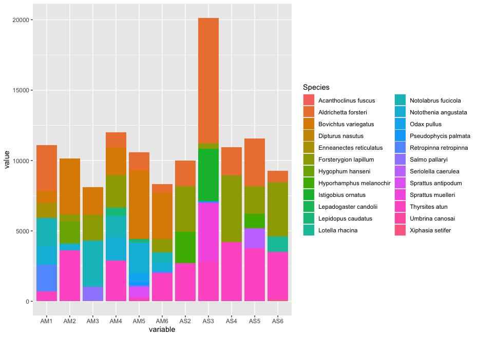
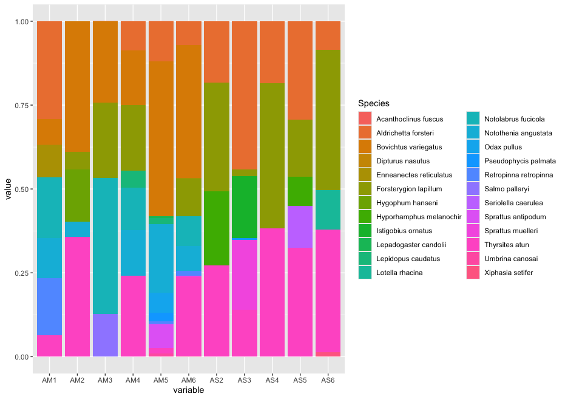
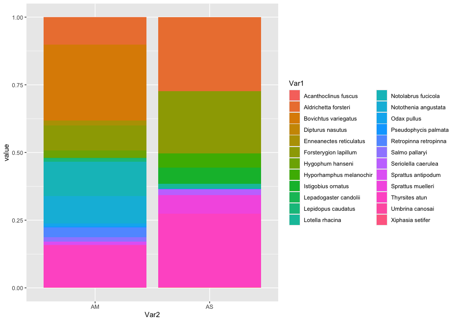
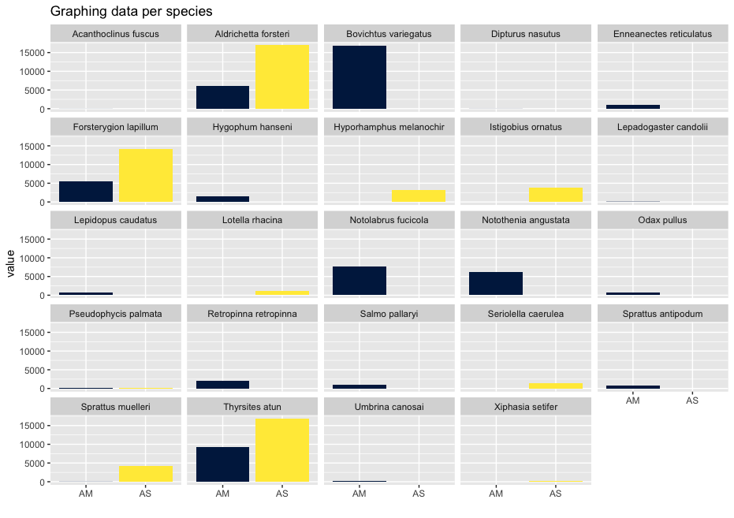
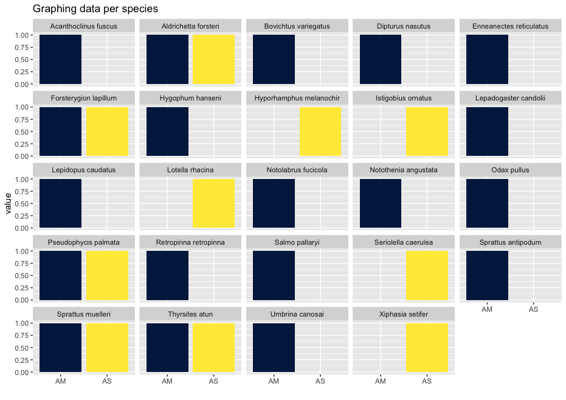
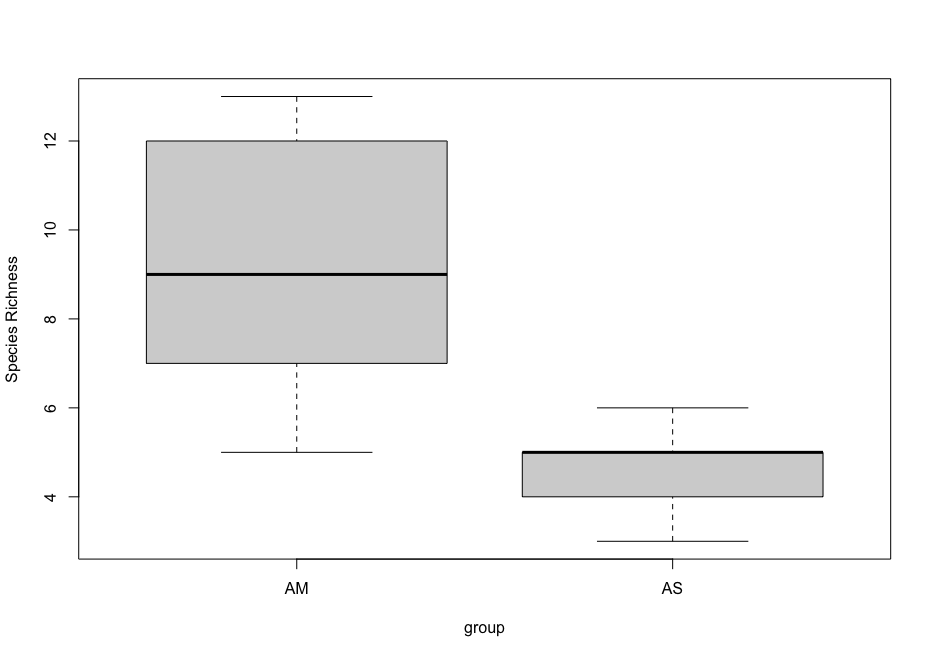
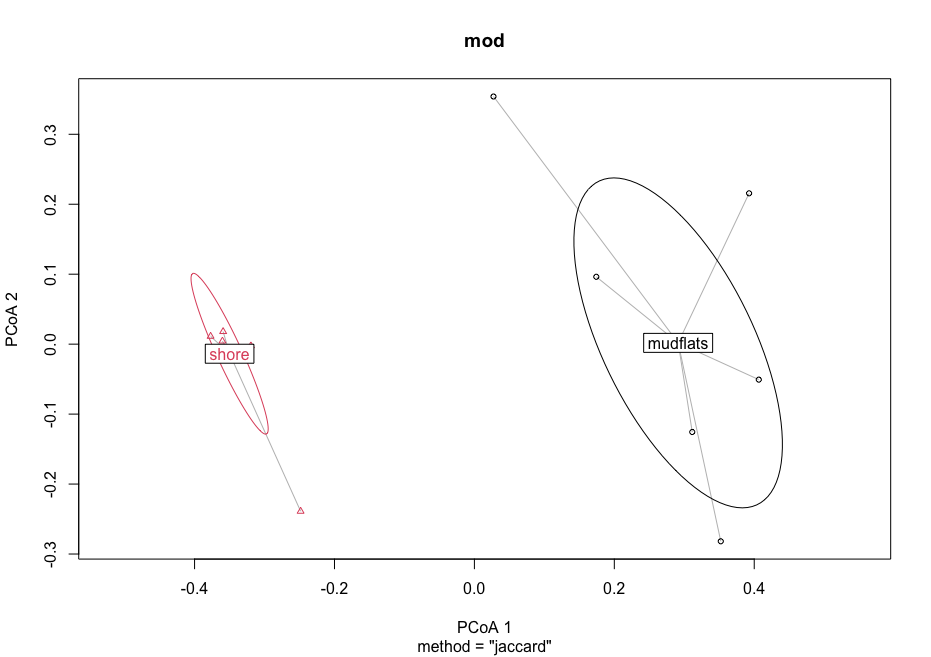
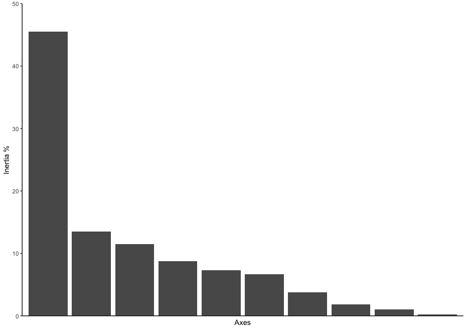

# Statistical analysis in R

In this last section, we'll go over a brief introduction on how to analyse the data files you've created during the bioinformatic analysis, i.e., the frequency table and the taxonomy assignments. Today, we'll be using **R** for the statistical analysis, though other options, such as **Python**, could be used as well. Both of these two coding languages have their benefits and drawbacks. Because most people know **R** from their Undergraduate classes, we will stick with this option for now.

Please keep in mind that we will only be giving a brief introduction to the statistical analysis. This is by no means a full workshop into how to analyse metabarcoding data. Furthermore, we'll be sticking to basic R packages to keep things simple and will not go into dedicated metabarcoding packages, such as  <a href="https://joey711.github.io/phyloseq/" target="_blank" rel="noopener noreferrer"><b>Phyloseq</b></a>.

## 1. Importing data in R

Before we can analyse our data, we need to import and format the files we created during the bioinformatic analysis, as well as the metadata file. We will also need to load in the necessary R libraries.

```R
## prepare R environment
setwd("~/obss_2024/edna/final")

## add workshop library
.libPaths(c(.libPaths(), "/nesi/project/nesi02659/obss_2024/R_lib"))

## load libraries
library('vegan')
library('lattice')
library('ggplot2')
library('labdsv')
library('tidyr')
library('tibble')
library('reshape2')
library('viridis')

## read data into R
count_table <- read.table('zotutable_new.txt', header = TRUE, sep = '\t', check.names = FALSE, comment.char = '')
taxonomy_table <- read.table('blast_taxonomy_new.txt', header = FALSE, sep = '\t', check.names = FALSE, comment.char = '')
metadata_table <- read.table('../stats/metadata.txt', header = TRUE, sep = '\t', check.names = FALSE, comment.char = '')

## merge taxonomy information with count table
colnames(count_table)[1] <- "V1"
count_table <- merge(count_table, taxonomy_table[, c("V1", "V4")], by = "V1", all.x = TRUE)
count_table$V1 <- NULL
colnames(count_table)[ncol(count_table)] <- "Species"
count_table <- aggregate(. ~ Species, data = count_table, FUN = sum)
rownames(count_table) <- count_table$Species
count_table$Species <- NULL
count_table_pa <- count_table
count_table_pa[count_table_pa > 0] <- 1
```

## 2. Preliminary data exploration

One of the first things we would want to look at, is to determine what is contained in our data. We can do this by plotting the abundance of each taxon for every sample in a stacked bar plot.

```R
## plot abundance of taxa in stacked bar graph
ab_info <- tibble::rownames_to_column(count_table, "Species")
ab_melt <- melt(ab_info)
ggplot(ab_melt, aes(fill = Species, y = value, x = variable)) +
  geom_bar(position = 'stack', stat = 'identity')
```



Since the number of sequences differ between samples, it might sometimes be easier to use relative abundances to visualise the data.

```R
## plot relative abundance of taxa in stacked bar graph
ggplot(ab_melt, aes(fill = Species, y = value, x = variable)) + 
  geom_bar(position="fill", stat="identity")
```



While we can start to see that there are some differences between sampling locations with regards to the observed fish, let's combine all samples within a sampling location to simplify the graph even further. We can do this by summing or averaging the reads.

```R
# combine samples per sample location and plot abundance and relative abundance of taxa in stacked bar graph
location <- count_table
names(location) <- substring(names(location), 1, 2)
locsum <- t(rowsum(t(location), group = colnames(location), na.rm = TRUE))
locsummelt <- melt(locsum)
ggplot(locsummelt, aes(fill = Var1, y = value, x = Var2)) +
  geom_bar(position = 'stack', stat = 'identity')
ggplot(locsummelt, aes(fill = Var1, y = value, x = Var2)) + 
  geom_bar(position="fill", stat="identity")

locav <- sapply(split.default(location, names(location)), rowMeans, na.rm = TRUE)
locavmelt <- melt(locav)
ggplot(locavmelt, aes(fill = Var1, y = value, x = Var2)) +
  geom_bar(position = 'stack', stat = 'identity')
ggplot(locavmelt, aes(fill = Var1, y = value, x = Var2)) + 
  geom_bar(position="fill", stat="identity")
```



As you can see, the graphs that are produced are easier to interpret, due to the limited number of stacked bars. However, it might still be difficult to identify which species are occurring in only one sampling location, due to the number of species detected and the number of colors used. A trick to use here, is to plot the data per species for the two locations.

```R
## plot per species for easy visualization
ggplot(locsummelt, aes(fill = Var2, y = value, x = Var2)) +
  geom_bar(position = 'dodge', stat = 'identity') +
  scale_fill_viridis(discrete = T, option = "E") +
  ggtitle("Graphing data per species") +
  facet_wrap(~Var1) +
  theme(legend.position = "non") +
  xlab("")
```



Plotting the relative abundance (transforming it indirectly to presence-absence) could help with distinguishing presence or absence in a sampling location, which could be made difficult due to the potentially big difference in read number.

```R
## plotting per species on relative abundance allows for a quick assessment 
## of species occurrence between locations
ggplot(locsummelt, aes(fill = Var2, y = value, x = Var2)) +
  geom_bar(position = 'fill', stat = 'identity') +
  scale_fill_viridis(discrete = T, option = "E") +
  ggtitle("Graphing data per species") +
  facet_wrap(~Var1) +
  theme(legend.position = "non") +
  xlab("")
```



## Alpha diversity analysis

Since the correlation between species abudance/biomass and eDNA signal strength has not yet been proven, alpha diversity analysis for metabarcoding data is currently restricted to species richness comparison. In the near future, however, we hope the abundance correlation is proven, enabling more extensive alpha diversity analyses.

```R
## species richness
## calculate number of taxa detected per sample and group per sampling location
specrich <- setNames(nm = c('colname', 'SpeciesRichness'), stack(colSums(count_table_pa))[2:1])
specrich <- transform(specrich, group = substr(colname, 1, 2))

## test assumptions of statistical test, first normal distribution, next homoscedasticity
histogram(~ SpeciesRichness | group, data = specrich, layout = c(1,2))
bartlett.test(SpeciesRichness ~ group, data = specrich)

## due to low sample number per location and non-normal distribution, run Welch's t-test and visualize using boxplot
stat.test <- t.test(SpeciesRichness ~ group, data = specrich, var.equal = FALSE, conf.level = 0.95)
stat.test
boxplot(SpeciesRichness ~ group, data = specrich, names = c('AM', 'AS'), ylab = 'Species Richness')
```

```
	Welch Two Sample t-test

data:  SpeciesRichness by group
t = 3.384, df = 6.5762, p-value = 0.01285
alternative hypothesis: true difference in means between group AM and group AS is not equal to 0
95 percent confidence interval:
 1.333471 7.799862
sample estimates:
mean in group AM mean in group AS 
        9.166667         4.600000 
```
{:output}



## Beta diversity analysis

One final type of analysis we will cover in today's workshop is in how to determine differences in species composition between sampling locations, i.e., beta diversity analysis. Similar to the alpha diversity analysis, we'll be working with a presence-absence transformed dataset.

Before we run the statistical analysis, we can visualise differences in species composition through ordination.

```R
## beta diversity
## transpose dataframe
count_table_pa_t <- t(count_table_pa)
dis <- vegdist(count_table_pa_t, method = 'jaccard')
groups <- factor(c(rep(1,6), rep(2,5)), labels = c('mudflats', 'shore'))
dis
groups
mod <- betadisper(dis, groups)
mod

## graph ordination plot and eigenvalues
plot(mod, hull = FALSE, ellipse = TRUE)
ordination_mds <- wcmdscale(dis, eig = TRUE)
ordination_eigen <- ordination_mds$eig
ordination_eigenvalue <- ordination_eigen/sum(ordination_eigen)
ordination_eigen_frame <- data.frame(Inertia = ordination_eigenvalue*100, Axes = c(1:10))
eigenplot <- ggplot(data = ordination_eigen_frame, aes(x = factor(Axes), y = Inertia)) +
  geom_bar(stat = "identity") +
  scale_y_continuous(expand = c(0,0), limits = c(0, 50)) +
  theme_classic() +
  xlab("Axes") +
  ylab("Inertia %") +
  theme(axis.ticks.x = element_blank(), axis.text.x = element_blank())
eigenplot
```





Next, we can run the statistical analysis PERMANOVA to determine if the sampling locations are significantly different. A PERMANOVA analysis will give a significant result when (i) the centroids of the two sampling locations are different and (ii) if the dispersion of samples to the centroid within a sampling location are different to the other sampling location.

```R
## permanova
source <- adonis(count_table_pa_t ~ Location, data = metadata_table, by = 'terms')
print(source$aov.tab)
```

```
Permutation: free
Number of permutations: 999

Terms added sequentially (first to last)

          Df SumsOfSqs MeanSqs F.Model      R2 Pr(>F)    
Location   1   0.88031 0.88031  10.146 0.52993  0.001 ***
Residuals  9   0.78087 0.08676         0.47007           
Total     10   1.66118                 1.00000           
---
Signif. codes:  0 ‘***’ 0.001 ‘**’ 0.01 ‘*’ 0.05 ‘.’ 0.1 ‘ ’ 1
```
{:output}

Since PERMANOVA can give significant p-values in both instances, we can run an additional test that only provides a significant p-value if the dispersion of samples to the centroid are different between locations.

```R
## test for dispersion effect
boxplot(mod)
set.seed(25)
permutest(mod)
```

```
Permutation test for homogeneity of multivariate dispersions
Permutation: free
Number of permutations: 999

Response: Distances
          Df   Sum Sq  Mean Sq      F N.Perm Pr(>F)
Groups     1 0.028786 0.028786 1.4799    999  0.243
Residuals  9 0.175055 0.019451  
```
{:output}

A final test we will cover today, is to determine which taxa are driving the difference in species composition observed during the PERMANOVA and ordination analyses. To accomplish this, we will calculate indicator values for each taxon and identify differences based on `IndValij = Specificityij * Fidelityij * 100`.

```R
## determine signals driving difference between sampling locations
specrich$Group <- c(1,1,1,1,1,1,2,2,2,2,2)
ISA <- indval(count_table_pa_t, clustering = as.numeric(specrich$Group))
summary(ISA)
```

```
                     cluster indicator_value probability
Bovichtus.variegatus       1          1.0000       0.003
Acanthoclinus.fuscus       1          0.8333       0.020
Notothenia.angustata       1          0.8333       0.012

Sum of probabilities                 =  11.46 

Sum of Indicator Values              =  9.83 

Sum of Significant Indicator Values  =  2.67 

Number of Significant Indicators     =  3 

Significant Indicator Distribution

1 
3 
```
{:output}

**That is all for the OBSS 2024 eDNA workshop. If you'd like a more in depth tutorial on eDNA metabarcoding data analysis, please visit my website (https://gjeunen.github.io/hku2023eDNAworkshop/intro.html). Thank you all for your participation. Please feel free to contact me for any questions (gjeunen@gmail.com)!**

