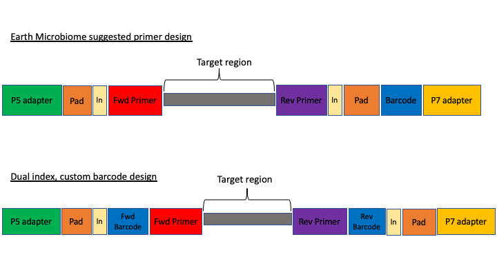
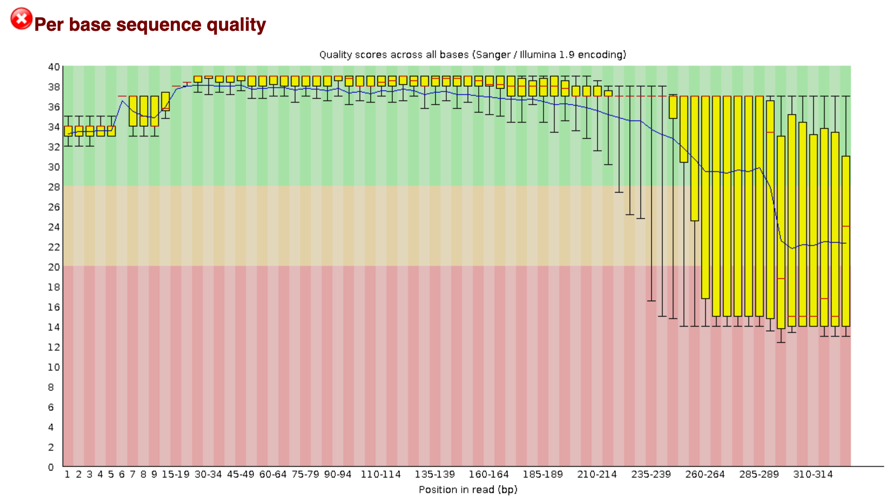

# Initial processing of raw sequence data

We will start where almost any data analysis begins (after creating metadata files of course), processing our raw data file. 


## Amplicon primer design

There are many ways to design metabarcoding primers to amplify your region of your interest from environmental samples. We will not cover too much experimental design in this course, but the way the experiment was set up will always influence how you approach the analysis. 

Here are two common methods. 

<center></center>

The first design above comes from the <a href="https://earthmicrobiome.org/" target="_blank" rel="noopener noreferrer"><b>Earth Microbiome project (EMP)</b></a>. In this method, the sequencing center will usually do the demultiplexing for you, because the barcode is in a region recognised by Illumina standard protocols. We will not cover this, but in these cases, you will get back a folder of multiple fastq sequence files, one for each sample (barcode). 

In the second case above, there are two barcodes, one on the forward primer (P5 adapter side) and one on the reverse (P7 adapter side). The advantage of this method, called *dual index*, is that it allows you to use the two barcodes in combination so you have fewer overall barcode-primers to order. However, you will need to demultiplex these sequences yourself. The example dataset uses this method. 

The next consideration is whether the sequencing method was *paired end* or *single end*. For paired end sequencing libraries, in the case of the EMP method, for each sample you will have one file for the forward sequence and one for the reverse; for the dual index strategy, you will have two files total, that will have to be demultiplexed in tandem. Usually in metabarcoding, after demultiplexing and filtering, the two pairs are merged together (and any that cannot be merged are not used). This is different from other types of NGS sequencing, like genome assembly or RNAseq, where the pairs are kept separate. 

The example dataset for today was created with single end sequencing, so there is just a single file. 


In order to use our data, we will have to clean it up by removing the primers and any sequence upstream or downstream of the primers, then filtering out any sequences that are too short or of low average quality. If the data has not been split into separate files for each sample, then we will need to also *demultiplex* the raw data file. 


To get started, navigate to the `data/` subfolder within the `~/obss_2021/edna/` directory. 

```bash
$ cd ~/obss_2021/edna
$ pwd
```

```
/home/username/obss_2021/edna
```
{: .output}


Assuming you are in the main directory:

```bash
$ cd data
```

and then use the `ls` command to see the contents of the subfolder

```bash
$ ls -lh
```

```
-rwxrwx---+ 1 hugh.cross nesi02659 119M Nov 20 04:25 FTP103_S1_L001_R1_001.fastq.gz
```
{: .output}

The `h` option in the ls command stands for *human readable*. This option will show the size of large files as MB (megabytes) or GB (gigabytes), instead of a long string of numbers representing the number of bytes.


You remember on Day 2 we went over FastQC. On the course page there is an image from a FastQC sequence quality data run on this file. You will see that the file still has a lot of poor quality sequence that have to be removed.





## Demultiplexing, trimming, and quality filtering

For the single-end, dual-indexed sequences that we are using today, we will need to demultiplex the raw fastq file. We also need to trim the primers and filter out low-quality reads. Fortunately, to avoid confusion we have written a short program that will do these steps for us. This program is freely available on the GitHub page. As well, on the workshop website, there are example commands for each of the steps.

The program, `cutadaptQC`, will read the primer and barcode sequences from the sample metadata file, and use these to create a new sequence file for each sample, which we can use for downstream analyses. It will also create a fasta file (without the quality information) for each final, filtered fastq file. Finally, the program will run FastQC on each final fastq file and then a program called **MultiQC** which combines all the separate FastQC files into one webpage. 


As with other programs you have seen, this program has options that you view with the `-h` argument. Before we can view the help documentation, we will need to navigate to the scripts folder and `source` the `eDNA.sh` file. This will load the module in our environment.

```bash
cd ../scripts/
source eDNA.sh
cutadaptQC -h
```

```
usage: cutadaptQC [-h] [-m METADATAFILE] [-r FASTQ] [-f DATAFOLDER] [-l MIN_LENGTH] [-x MAX_LENGTH] [-a MAXN]
                  [-e ERROR] [-n PROJECTNAME] [-t THREADS]

Run cutadapt to demultiplex and quality control raw sequence data

optional arguments:
  -h, --help            show this help message and exit

arguments:
  -m METADATAFILE, --metadata_file METADATAFILE
                        sample metadata file
  -r FASTQ, --raw_fastq FASTQ
                        Raw data file to be processed
  -f DATAFOLDER, --data_folder DATAFOLDER
                        Folder to process sequence data
  -l MIN_LENGTH, --min_length MIN_LENGTH
                        [OPTIONAL] minimum length for reads (default:150)
  -x MAX_LENGTH, --max_length MAX_LENGTH
                        [OPTIONAL] maximum length for reads (default:300)
  -a MAXN, --max_n MAXN
                        [OPTIONAL] maximum number of Ns in sequence (default:0)
  -e ERROR, --error ERROR
                        [OPTIONAL] maximum expected error value (default:1.0)
  -n PROJECTNAME, --name PROJECTNAME
                        [OPTIONAL] Name of project (default:"fish")
  -t THREADS, --threads THREADS
                        [OPTIONAL] number of CPUs to use (default:1)
```
{: .output}


Because there are a few options to add here, we will be running this program using a *bash script*, As we have done on Day 2 and 3 of this workshop. 

> ## Build a script to run the program cutadaptQC
>To start, we will navigate to the scripts folder if you are not there already. Then, we will open a new file by using the `nano` text editor that is incorporated into the terminal. When we run this command, it will open a new file wherein we can write our code.
>
>```bash
>nano trim_qc.sh
>```
>
> Hints:
> First, you need to tell the script what modules to load so all software can be accessed. All of the modules that need to load are incorporated into the `eDNA.sh` file.
>
> ```bash
> source eDNA.sh
> ```
> 
> Now, we can add the actual command to the script. When we ran the help command for this program, it gave us the options we need to input along with the name of the program. There are several parameters we are required to fill in and others (with a default option) are only needed if the default values do not suit your specific requirements. I recommend following the options in the help documentation, to make sure that you do not forget to enter one of the parameters.
>
>`-m`: the program needs the metadata file to know which barcode and primer sequences to use for each sample. This file can be find in the `docs/` folder, so we need to remember to add the (relative) path.
>
>`-r`: indicates the raw sequencing file (FTP103_S1_L001_R1_001.fastq.gz), which is located in the `data/` folder.
>
>`-f`: indicates the folder where all the processed files will be stored. Today, we will use the `data/` folder.
>
>`-n`: for the project name, we will use `fish_project`, given the sequencing data represents the fish diversity observed at Otago Harbour.
>
>`-t`: we can set the number of threads to 4.
>
> We can leave the default values for all other options, as the `minimum` and `maximum` length are within our amplicon range, Illumina sequencing data should not have `N` basecalls, and the `error rate` of 1.0 is a standard approach in processing metabarcoding data.
>
> We can exit out of `nano` by pressing `ctr+x`, followed by `y` and `enter` to save the file.
>
>> ## Solution
>> Your script should look like this:
>>
>> ~~~
>> source eDNA.sh
>> 
>> cd ~/obss_2021/edna
>>
>> cutadaptQC \
>>  -m ./docs/sample_metadata.tsv \
>>  -r ./data/FTP103_S1_L001_R1_001.fastq.gz \
>>  -f ./data \
>>  -n fish_project \
>>  -t 4 \
>> ~~~
>>
> {: .solution}
{: .challenge}


Now, to run this script, in the terminal run it like this:

```bash
$ bash trim_qc.sh
```

If it works, then you should see the outputs begin to be generated. This will take a a minute or two to run. While this is running, in the Folder tab, you can navigate over to the data folder, where you should see new subfolders with the trimmed fastq and fasta files.


Once the script has finished, you should have five new subfolders in your data/ folder: 

- trimmed
- fastq
- fasta
- fastq_qc
- {Project Name}_multiqc_report_data

The `trimmed/` subfolder has the fastq sequence files from which primers and barcode sequences have been removed. There is now one for each sample. The `fastq/` folder has the fastq sequence files files, in which each file has taken the corresponding trimmed file and run a quality filter and removed any sequences below the minimum length. The fasta files in the `fasta/` are from the fastq files, from which any quality information has been removed. The `fastq_qc` folder contains all the FastQC output, and the `{Project Name}_multiqc_report_data` folder (substitute your project name for `{Project Name}`).

In addition to these folders, you also have a web file that is the multiQC report: `{Project Name}_multiqc_report.html`. Go ahead and double click on this file to open it. Once opened, you will see what looks like a FastQC file, but one that has the combined results for all the files. In the upper part of the file, there is text that says `Trust HTML`. Click on this to see all the figures in the graph (This is a security precaution for Jupyter).


In the terminal, we can have a peek at some of the other files:

```bash
$ cd ../data/fastq

$ head -n 12 AM1_filt.fastq
```

```
@AM1.1
GAAAGGTAGACCCAACTACAAAGGTCCCCCAATAAGAGGACAAACCAGAGGGACTACTACCCCCATGTCTTTGGTTGGGGCGACCGCGGGGGAAGAAGTAACCCCCACGTGGAACGGGAGTACAACTCCTTGAACTCAGGGCCACAGCTCTAAGAAACAAAATTTTTGACCTTAAGATCCGGCAATGCCGATCAACGGACCG
+
2E2AEHHFHFGGEGGEHFGHGHGCFFEGGEFDGHHEFFEFGGGFFFE1CGGGGFGCGHGHHGGECHFHFHHHGGHHGGGGFCGCCGFCCGGGGGGHHG0CGHHHDCFFCGEGBFFGDFD?DBBFFBFFFFFFFFFFFFFE?DDDEFFFFFFFFFFFFFFFFFFFFFFAEFFFFFFFFFFFFFF;BFFFFFFFFDBFDADCFF
@AM1.2
ACAAGGCAGCCCCACGTTAAAAAACCTAAATAAAGGCCTAAACTTACAAGCCCCTGCCCTTATGTCTTCGGTTGGGGCGACCGCGGGGTAAAAAATAACCCCCACGTGGAATGGGGGCATAAACACCCCCCCAAGTCAAGAGTTACATCTCCAGGCAGCAGAATTTCTGACCATAAGATCCGGCAGCGCCGATCAGCGAACCA
+
HH4FHHGGGGFGDEEEHHFEFFFGGGHHFHHEFHHEFGHHHFGHHHHGFHGFHGHEEHHHHHHHHFHHFEEGGGGGGGCGCG/B?CFGFGHHHHGHHHHHHGGGGGGAADFG0B?DGGGGGFGGGFDFGFFFFF.BBFFFFFFFFFFFFFFFFFEEEDFF.BFFFFFFFEFFFFFFFFFFFFFFCFFFFFFFFFDFFFFFFFF
@AM1.3
ACAAGGCAGCCCCACGTTAAAAAACCTAAATAAAGGCCTAAACTTACAAGCCCCTGCCCTTATGTCTTCGGTTGGGGCGACCGCGGGGTAAAAAATAACCCCCACGTGGAATGGGGGCATAAACACCCCCCCAAGTCAAGAGTTACATCTCCAGGCAGCAGAATTTCTGACCATAAGATCCGGCAGCGCCGATCAGCGAACCA
+
HH4AGHHGGDGEEGA?GHFGFHGFGFHGHHHFHHGGGFHGFGHHHFHHFFHFGGHEGFGFHHHGHFFHFGGGGGGGGGGGGG?@/CFGGGHHHHGHHHHHHGGGFGCCEDGG0FEFGGGGFBFGGFDDGCFAFF?FFFFFEFBBFFEFFFFFFFFFEFFF;BBFFFFFF/FFFFFFFFFFFFFFAFFFFFFFFFFFFFFFFFF
```
{: .output}



