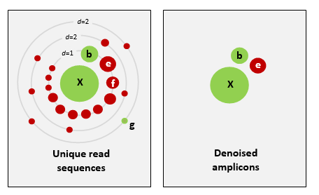

## Introduction

Now that our sequences have been trimmed and filtered, we can proceed to the next step, which will create a set of representative sequences. We do this by clustering all the sequences to look for biologically meaningful sequences, those that are thought to represent actual taxa, while trying to avoid differences caused by sequence or PCR errors, and remove any *chimeric* sequences.

Scientists are currently debating on what the best approach is to obtain `biologically meaningful` or `biologically correct` sequences. There are numerous papers published on this topic. Unfortunately, this is something that is outside the scope of this workshop to go into at depth. But here is the basic information…  
  
There are basically two trains of thought, clustering the dataset or denoising the dataset. With clustering the dataset, an OTU (Operational Taxonomic Unit) sequence should be at least a given percentage different from all other OTUs and should be the most abundant sequence compared to similar sequences. People traditionally chose to cluster at 97%, which means that the variation between sequences should be at least 3%. The concept of OTU clustering was introduced in the 1960s and has been debated ever since. With denoising the dataset, on the other hand, the algorithm attempts to identify all correct biological sequences in the dataset, which is visualized in the figure below. This schematic shows a clustering threshold at 100% and trying to identify errors based on abundance differences. The retained sequences are called ZOTU or Zero-radius Operational Taxonomic Unit. In other software programs they might also be called ASVs.

For purposes of clarity, we will call all these representative sequences **OTUs**, as that is the most common and oldest term for this type.



This difference in approach may seem small but has a very big impact on your final dataset!  
  
When you denoise the dataset, it is expected that one species may have more than one ZOTU, while if you cluster the dataset, it is expected that an OTU may have more than one species assigned to it. This means that you may lose some correct biological sequences that are present in your data when you cluster the dataset, because they will be clustered together. In other words, you will miss out on differentiating closely related species and intraspecific variation. For denoising, on the other hand, it means that when the reference database is incomplete, or you plan to work with ZOTUs instead of taxonomic assignments, your diversity estimates will be highly inflated.  
  
For this workshop, we will follow the `clustering` pathway, since most people are working on vertebrate datasets with good reference databases and are interested in taxonomic assignments.


Prior to clustering or denoising, we need to dereplicate our data into unique sequences. Since metabarcoding data is based on an amplification method, the same starting DNA molecule can be sequenced multiple times. In order to reduce file size and computational time, it is convenient to combine these duplicated sequences as one and retain information on how many were combined. Additionally, we will remove sequences that only occur once in our data and attribute them to sequence and PCR error. Lastly, we will sort the sequences based on abundance.

Before we do all of this, we need to combine all of the fasta files into a single file. In the terminal, navigate to the `data/fasta/` folder:

```bash
$ cd ~/obss_2021/edna/data/fasta
```

Now we will just concatenate all the fasta files into one using the `cat` command:

```bash
$ cat *.fasta > combined.fasta
```

For the actual dereplication, size sorting, and clustering, we will be running these commands using bash scripts. Therefore, we need to navigate back to the `scripts/` folder and create a new script.

```bash
$ cd ../../scripts
```

> ## Build a script to dereplicate the data and sort sequences based on abundance
>Similarly to the previous script, we will use the `nano` text editor to generate the `.sh` file 
>
>```bash
>nano dereplicate_seqs.sh
>```
>
>For this and the next scripts, we will use the program VSEARCH (https://github.com/torognes/vsearch). To load this module, we can source the `eDNA.sh` file, as you did in the previous script.
>
>```bash
>source eDNA.sh
>```
>
>Remember that the bash script is being executed from the `scripts` folder. Since we want to save our OTUs in the `otus` folder, we will need to indicate this in the script.
>
>In this bash script, we will run two commands: one to `dereplicate` the sequences and another to `sort` the sequences by abundance. Below, you can find the two commands for this. Please note that in a bash script we can run commands sequentially by putting them one after another. Also note how the second command uses an input file that was generated as an output file in the first command.
>
>```bash
>vsearch --derep_fulllength "INPUT_FILENAME_1" --minuniquesize 2 --sizeout --output "OUTPUT_FILENAME_1" --relabel Uniq.
>
>vsearch --sortbysize "OUTPUT_FILENAME_1" --output "OUTPUT_FILENAME_2"
>```
>
>Similarly to what we did during the first bash script, we can exit out of `nano` by pressing `ctr+x`, followed by `y` and `enter` to save the file.
>
>Remember that to run the script, we use `bash`, followed by the filename.
>
>```bash
>bash dereplicate_seqs.sh
>```
>
>> ## Solution
>> Your script should look like this:
>>
>> ~~~
>> source eDNA.sh
>>
>> cd ../otus/
>>
>> vsearch --derep_fulllength ../data/fasta/combined.fasta \
>>--minuniquesize 2 \
>>--sizeout \
>>--output derep_combined.fasta \
>>--relabel Uniq.
>>
>> vsearch --sortbysize derep_combined.fasta \
>>--output sorted_combined.fasta
>> ~~~
>>
> {: .solution}
{: .challenge}

To check if everything executed properly, we can list the files that are in the `otus` folder and check if both output files have been generated (`derep_combined.fasta` and `sorted_combined.fasta`).

```bash
$ ls -ltr ../otus/
```

```
-rw-rw----+ 1 hugh.cross nesi02659 545795 Nov 24 03:52 derep_combined.fasta
-rw-rw----+ 1 hugh.cross nesi02659 545795 Nov 24 03:52 sorted_combined.fasta
```
{: .output}

We can also check how these commands have altered our files. Let's have a look at the `sorted_combined.fasta` file, by using the `head` command.

```bash
$ head ../otus/sorted_combined.fasta
```

```
>Uniq.1;size=19583
TTTAGAACAGACCATGTCAGCTACCCCCTTAAACAAGTAGTAATTATTGAACCCCTGTTCCCCTGTCTTTGGTTGGGGCG
ACCACGGGGAAGAAAAAAACCCCCACGTGGACTGGGAGCACCTTACTCCTACAACTACGAGCCACAGCTCTAATGCGCAG
AATTTCTGACCATAAGATCCGGCAAAGCCGATCAACGGACCG
>Uniq.2;size=14343
ACTAAGGCATATTGTGTCAAATAACCCTAAAACAAAGGACTGAACTGAACAAACCATGCCCCTCTGTCTTAGGTTGGGGC
GACCCCGAGGAAACAAAAAACCCACGAGTGGAATGGGAGCACTGACCTCCTACAACCAAGAGCTGCAGCTCTAACTAATA
GAATTTCTAACCAATAATGATCCGGCAAAGCCGATTAACGAACCA
>Uniq.3;size=8755
ACCAAAACAGCTCCCGTTAAAAAGGCCTAGATAAAGACCTATAACTTTCAATTCCCCTGTTTCAATGTCTTTGGTTGGGG
```
{: .output}


> ## Study Questions
>What do you think the following parameters are doing?
>
> - `--sizeout`
> - `--minuniquesize 2`
> - `--relabel Uniq.`
>
>> ## Solution
>> `--sizeout`: this will print the number of times a sequence has occurred in the header information. You can use the `head` command on the sorted file to check how many times the most abundant sequence was encountered in our sequencing data.
>>
>> `--minuniquesize 2`: only keeps the dereplicated sequences if they occur twice or more. To check if this actually happened, you can use the `tail` command on the sorted file to see if there are any dereplicates sequences with `--sizeout 1`.
>>
>> `--relabel Uniq.`: this parameter will relabel the header information to `Uniq.` followed by an ascending number, depending on how many different sequences have been encountered.
>>
> {: .solution}
{: .challenge}

Now that we have dereplicated and sorted our sequences, we can cluster our data, remove chimeric sequences, and generate a frequency table. We will do this by generating our third script

> ## Build a script to generate a frequency table
>Again, we will use the `nano` text editor to generate the `.sh` file 
>
>```bash
>nano cluster.sh
>```
>
>We will be using VSEARCH again for all three commands, so we will need to source the `eDNA.sh` file in our script.
>
>```bash
>source eDNA.sh
```
>
>Remember that the bash script is being executed from the `scripts` folder. For all three commands, we will output the generated files in the `otus` folder. Therefore, we will need to indicate this in the bash script.
>
>In this bash script, we will run three commands: one to `cluster` the sequences using a user-specified similarity threshold, one to remove `chimeric` sequences, and one to generate a `frequency` table. Below, you can find all three commands that we will use. 
>
>```bash
>vsearch --cluster_size "OUTPUT_FILENAME_2" --centroids "OUTPUT_FILENAME_3" --sizein --id 0.97 --sizeout
>
>vsearch --uchime3_denovo "OUTPUT_FILENAME_3" --sizein --fasta_width 0 --nonchimeras "OUTPUT_FILENAME_4" --relabel OTU.
>
>vsearch --usearch_global "INPUT_FILENAME_1" --db "OUTPUT_FILENAME_4" --id 0.97 --otutabout "OUTPUT_FILENAME_5"
>```
>
>Similarly to what we did during the first bash script, we can exit out of `nano` by pressing `ctr+x`, followed by `y` and `enter` to save the file.
>
>Remember that to run the script, we use `bash`, followed by the filename.
>
>```bash
>bash cluster.sh
>```
>
>> ## Solution
>> Your script should look like this:
>>
>> ~~~
>> source eDNA.sh
>>
>> cd ../otus/
>>
>> vsearch --cluster_size sorted_combined.fasta \
>>--centroids centroids.fasta \
>>--sizein \
>>--id 0.97 \
>>--sizeout
>>
>> vsearch --uchime3_denovo centroids.fasta \
>>--sizein \
>>--fasta_width 0 \
>>--nonchimeras otus.fasta \
>>--relabel OTU.
>>
>>vsearch --usearch_global ../data/fasta/combined.fasta \
>>--db otus.fasta \
>>--id 0.97 \
>>--otutabout otu_frequency_table.tsv
>> ~~~
>>
> {: .solution}
{: .challenge}

> ### Tip
> Check the example commands above, do you need to change any paths?
{: .callout}

> ## Study Questions
> The results of the last script creates three files: `centroids.fasta`, `otus.fasta`, and `otu_frequency_table.tsv`. 
> Let's have a look at these files to see what the output looks like. From looking at the output, can you guess what some of these VSEARCH parameters are doing?
> 
> - `--sizein`
> - `--sizeout`
> - `--centroids`
> - `--relabel`
> 
> How about `--fasta_width 0`? Try rerunning the script without this command to see if you can tell what this option is doing. 
>
> Hint: you can always check the help documentation of the module by loading the module `source eDNA.sh` and calling the help documentation `vsearch -h` or by looking at the manual of the software, which can usually be found on the website.
> 
{: .challenge}

<br><br>

> ## Optional extra 1
> 
> We discussed the difference between denoising and clustering. You can change the last script to have VSEARCH do clustering instead of denoising. 
> Make a new script to run clustering. It is similar to `cluster.sh`, except you do not use the `vsearch --cluster_unoise` command. Instead you will use:
> 
> ```
> vsearch --cluster_unoise sorted_combined.fasta --sizein --sizeout --fasta_width 0 --centroids centroids_unoise.fasta
> ```
> 
> You will still need the commands to remove chimeras and create a frequency table. 
> Make sure to change the names of the files so that you are making a **new** frequency table and OTU fasta file (maybe call it `asvs.fasta`). 
> If you leave the old name in, it will be overwritten when you run this script. 
> 
> Give it a try and compare the number of OTUs between clustering and denoising outputs. 
{: .challenge}

> ## Optional extra 2 
>
> The `--id` argument is critical for clustering. What happens if you raise or lower this number? 
> Try rerunning the script to see how it changes the results. Note: make sure to rename the output each time or you will not be able to compare to previous runs. 
{: .challenge}



