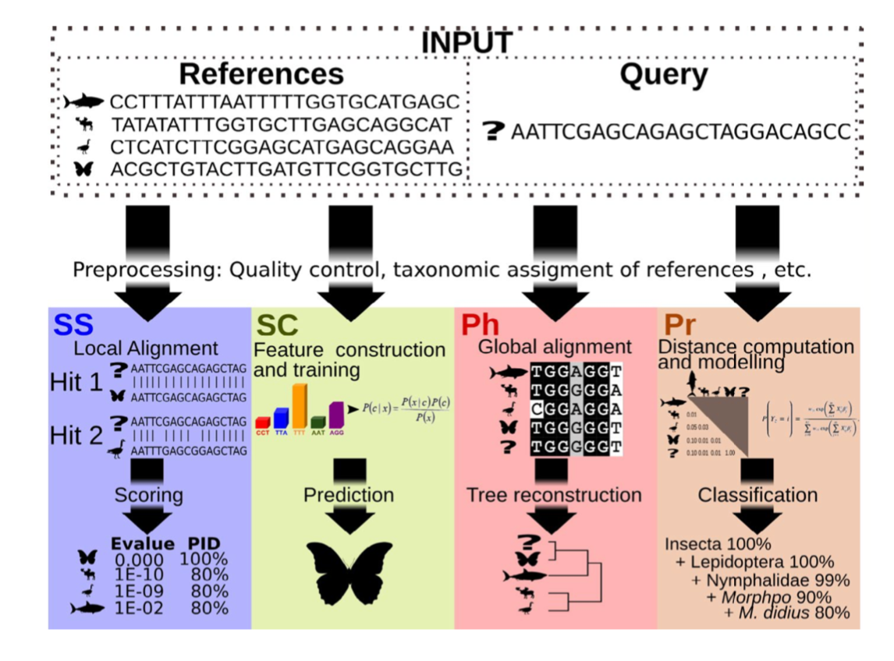
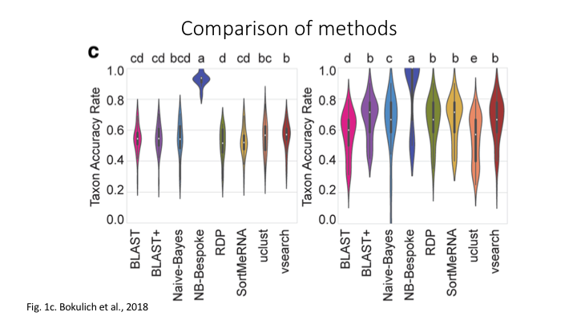
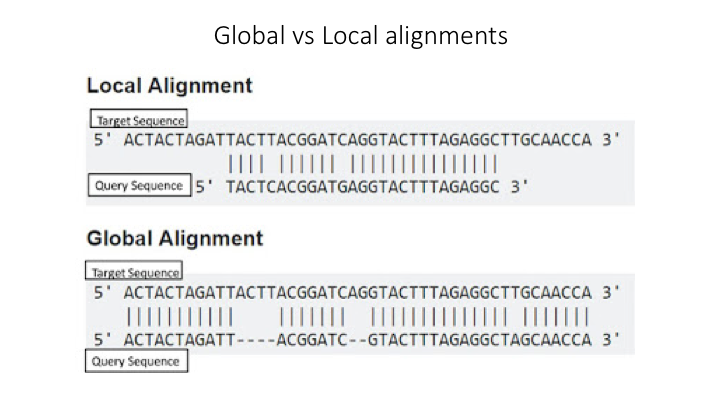

# Taxonomy Assignment: Different Approaches

There are four basic strategies to taxonomy classification (and endless variations of each of these): **sequence similarity** (SS), **sequence composition** (SC), **phylogenetic** (Ph), and probabilistic (Pr) (<a href="https://onlinelibrary.wiley.com/doi/epdf/10.1111/1755-0998.13407" target="_blank" rel="noopener noreferrer"><b>Hleap et al., 2021</b></a>).
    




Of the four, the first two are those most often used for taxonomy assignment. For further comparison of these refer to <a href="https://microbiomejournal.biomedcentral.com/articles/10.1186/s40168-018-0470-z" target="_blank" rel="noopener noreferrer"><b>this paper</b></a>.




## Aligment-Based Methods (SS)

All sequence similarity methods use global or local alignments to directly search a reference database for partial or complete matches to query sequences. BLAST is one of the most common methods of searching DNA sequences. BLAST is an acronym for Basic Local Alignment Search Tool. It is called this because it looks for any short, matching sequence, or *local alignments*, with the reference. This is contrasted with a *global alignment*, which tries to find the best match across the entirety of the sequence.  





<br><br>

## Using Machine Learning to Assign Taxonomy

Sequence composition methods utilise machine learning algorithms to extract compositional features (e.g., nucleotide frequency patterns) before building a model that links these profiles to specific taxonomic groups. 


<br><br>


## Use the program Sintax to classify our OTUs

The program <a href="https://www.drive5.com/usearch/manual/cmd_sintax.html" target="_blank" rel="noopener noreferrer"><b>Sintax</b></a> is similar to the Naive Bayes classifier used in Qiime and other programs, in that small 8 bp kmers are used to detect patterns in the reference database, but instead of frequency patterns, k-mer similarity is used to identify the top taxonomy, so there is no need for training (<a href="https://www.drive5.com/usearch/manual/sintax_algo.html" target="_blank" rel="noopener noreferrer">Here is a description of the Sintax algorithm</a>). Because of this, it is simplified and can run much faster. Nevertheless, we have found it as accurate as Naive Bayes for the fish dataset we are using in this workshop.

As with the previous steps, we will be using a bash script to run the classification. As before, we will use VSEARCH to run Sintax.

Go to the `scripts` folder and create a file called *classify_sintax.sh*, using either Nano (`nano classify_sintax.sh`) or from the Launcher in Jupyter. 

To access any program needed for this workshop, first source the eDNA.sh file

```
source eDNA.sh
```


The VSEARCH command has many functions and many options. In the command line, you can list these more easily using `less`:

```
vsearch -h | less
```

Looking at a long help command this way allows you to scroll up and down the help options. For the sintax script, you will need to fill in these parameters:

- `--sintax`
- `--db`
- `--sintax_cutoff`
- `--tabbedout`

> ## Write a script to run sintax through VSEARCH
> 
> Hints:
> 
> Start to fill in the neccessary components. We will go through each of the arguments.
> 
> When you start searching with `less`, you can quit anytime by just entering `q`. 
> 
> You can also search for a specific part of the help output by entering a forward slash (`/`), followed by the term you are looking for
> 
> You can go to top of the search by entering `gg`, and to the bottom by entering `G`.
> 
> Try to figure out which parameter you need to fill in for each of these options. 
> 
> To get you started, the `--sintax` argument has to go right after `vsearch`, and its parameter is the name of the OTU file you created in the last lesson
>
>> ## Solution
>> 
>> ~~~bash
>> source ~/obss_2021/edna/scripts/eDNA.sh
>> 
>> cd ~/obss_2021/edna/taxonomy/
>>
>> vsearch --sintax \
>>  ../otus/otus.fasta \
>>  --db ../references/aramoana_ref_db.fasta \
>>  --sintax_cutoff 0.8 \
>>  --tabbedout sintax_raw_taxonomy.tsv
>> ~~~
>> After the first line, we just put the name of the OTU file from the clustering lesson, remember the path is needed to point the program to where the file is
>>
>> On the next line, after the `--db`, put the path `../references/` and the reference file. 
>>
>> The next line is for the confidence cut off. If the estimated confidence of a taxonomic assignment falls below this number, the assignment will not be recorded. >> The default for this is 0.6, but we will use a higher cutoff of `0.8` for the `--sintax_cutoff` argument.
>>
>> The final line is to name the output file. You can use any name, but it is better to include some information such as the name of the OTUs and program used    >> (sintax), in case want to compare the results with other runs. Also include the suffix `.tsv`, which will tell Jupyter that it is a table file.
>>
> {: .solution}
{: .challenge}


Now you are done. Save and close the file. Then run it on the command line.

```
bash classify_sintax.sh
```


Have a look at the output file. Find the file in the taxonomy folder and double click to open it in Jupyter. You will see it is divided into two main parts. The first includes the name of each rank (e.g. *p:Chordata* to indicate the phylum Chordata), followed by the confidence for the assignment at that rank in parentheses. The second section, which follows the *+*, has only the name of each rank and includes only those ranks whose confidence is above the `--sintax_cutoff` parameter used. 


> ## Study Questions
>
> Name an OTU that would have better resolution if the cutoff were set to default
> 
> Name an OTU that would have worse resolution if the cutoff were set higher
> 
{: .challenge}


## Visualisation in Qiime

In Qiime, all the visuals are run as interactive web apps--they need to run on a web browser. In this course we will focus on creating graphs and plots using R. However, we have provided some links to visuals for the OTUs and taxonomy for this data set, in order to show how some of the visuals work. 

For all these plots, they need to be opened on a webpage called Qiime2View. Click on the following link to open it in a new tab:

<a href="https://view.qiime2.org/" target="_blank" rel="noopener noreferrer"><b>Qiime2View webpage</b></a>

To see a table of the taxonomy assignment of each OTU, paste the following link into the Qiime2View webpage (do not click on it).

**https://otagoedna.github.io/2019_11_28_edna_course/example_viz/fish_NB_taxonomy_VIZ.qzv**

Then go to the Qiime2View website, click on 'file from the web', and paste the link in the box that opens up.

<br>

The next plot is a barplot graph of the taxonomy. A barplot graph is a good way to compare the taxonomic profile among samples. 

Paste the following link into the Qiime2View page:

**https://otagoedna.github.io/2019_11_28_edna_course/example_viz/fish_NB_taxonomy_barplot.qzv**

<br>

We are also including a table of the OTU sequences.

**https://otagoedna.github.io/2019_11_28_edna_course/example_viz/zotus_tabulation.qzv**

This visual shows the sequence for each OTU. You can run a BLAST search on each OTU by clicking on the sequence. However, the search can take a while, depending on how busy the NCBI server is.

<br><br>

## Converting the output file

While the sintax output file is very informative, we will convert it to a simpler format that will make it easier to import into other downstream applications. Fortunately, the eDNA module has a script that will convert the file into several other formats. At the terminal prompt, go to the taxonomy folder and enter the script name and the help argument

```bash
convert_tax2table.py -h
```

You will see the options:

```
usage: convert_tax2table.py [-h] [-i INPUT] [-o OUTPUT] [-f FORMAT]

Convert taxonomy output to tabular format

optional arguments:
  -h, --help            show this help message and exit

arguments:
  -i INPUT, --input_file INPUT
                        Input taxonomy file to convert
  -o OUTPUT, --output_table OUTPUT
                        Name of output table
  -f FORMAT, --format FORMAT
                        Format of input file, options: "sintax","idtaxa","qiime"; default=sintax
```
{: .output}

This program will run very fast, so you can run it on the command line. Check the output. You should see a new table with each taxonomic rank in its own column. (**Hint:** if you name the output file with `.tsv` at the end, then it will open in Jupyter as a table.)

```bash
cd ../taxonomy

convert_tax2table.py -i sintax_raw_taxonomy.tsv -o sintax_taxonomy.tsv
```

<br><br>


<br><br>

>## Extra exercise: use IDTaxa for taxonomy assignment
>
> There are many methods available for taxonomy assignment. Another popular option is <a href="http://www2.decipher.codes/Classification.html" target="_blank" rel="noopener noreferrer"><b>IDTaxa</b></a>. IDTaxa is a variant of the RDP machine learning approach, discussed above. 
> 
> Write a bash script to run this program. 
> 
> Guide:
>
> - IDTaxa requires the reference data to be trained. We have made a pre-trained classifier available for you in the `/references` subfolder. 
> - IDTaxa is a R package from the Bioconductor library, so you will need to load the Bioconductor R bundle, which will also load R:
>  `module load R-bundle-Bioconductor/3.13-gimkl-2020a-R-4.1.0`
> - To run this on the command line, there is an R script in the `/scripts` subfolder that will run IDTaxa, and then convert the output to a table: `run_IDTaxa.R` 
> - To run a R script from the command line or a bash script, you need to use the command `RScript --vanilla`, followed by the name of the script.
> - For this R script, the arguments come after the script and have to be entered in this order:
>  `Rscript --vanilla run_IDTaxa.R <IDTaxa_classifier> <otu_fasta> <output_file>`
> 
>> ## Solution
>> 
>> Your script should contain these lines (assuming you are running it from the scripts folder)
>> 
>> ```
>> module purge
>> module load R-bundle-Bioconductor/3.13-gimkl-2020a-R-4.1.0
>> 
>> Rscript --vanilla \
>>   run_IDTaxa.R \
>>   ../references/fish_lrRNA_idtaxa_classifier.rds \
>>   ../otus/otus.fasta \
>>   ../taxonomy/idtaxa_taxonomy.tsv
>> ```
>> 
>> Note that you do not have to split this across separate lines with a `\`, but it helps to read the code.
>> 
> {: .solution}
{: .challenge}


